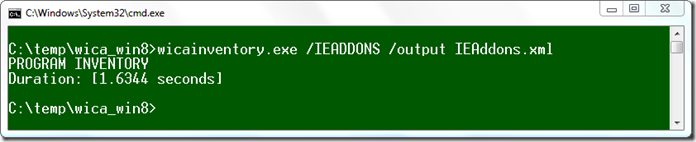
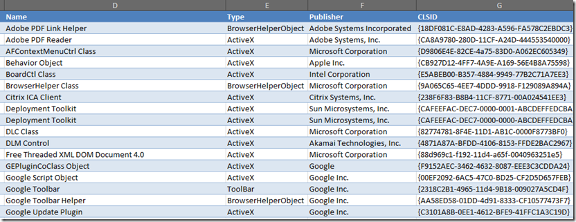

The Windows 8 developer preview build installation media contains an executable called wicainventory.exe. Wicainventory tool collects application and device information. There is also a wica.ini file that contains 2 URLs. I assume that the Tool is used by Microsoft to collect telemetry data. 

  While there are plenty of other methods to collect software and hardware inventory data, wicainventory provides a nice way to collect Internet Explorer add-on information. For running wicainventory standalone the following files must be copied from the Windows 8 installation sources. 

  .:\sources\wicainventory.exe   
.:\sources\wica.dll    
.:\sources\aeinv.dll    
.:\sources\devinv.dll

  To collect Internet Explorer Add-on information, run the following command at the command prompt. 

  wicainventory.exe /IEADDONS /output IEAddons.xml

  

  With a few clicks the output xml can be easily imported into Microsoft Excel where then you get a clear view of the installed Internet Explorer Add-on’s. 

  

