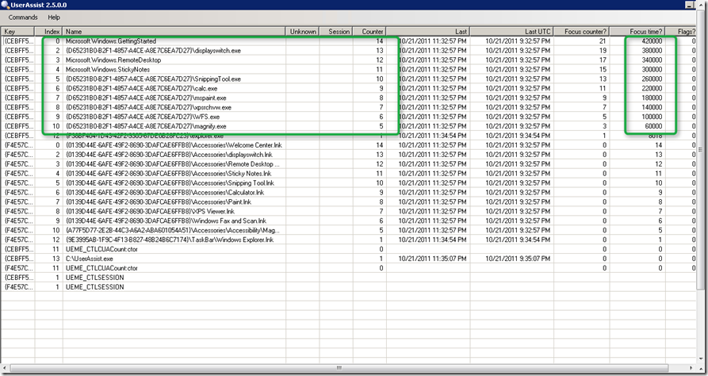
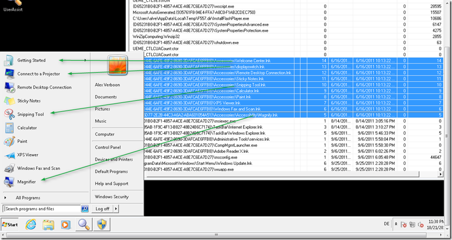
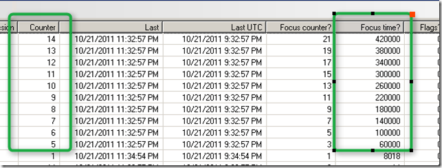
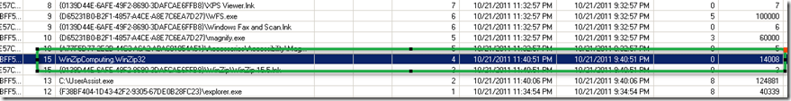
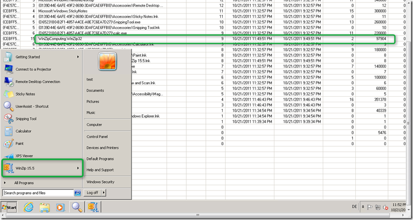

This week I found an interesting tool called UserAssist.exe written by Didier Stevens. The UserAssist tool lists the UserAssist registry keys  stored under HKEY_CURRENT_USER\Software\Microsoft\Windows\CurrentVersion\Explorer\UserAssist. This is the location where Windows 7 (and earlier versions of Windows) retrieves the information about the execution frequency of applications started by users. If you are interested about the details of the UserAssist registry keys I recommend that you read some of Didier Stevens [blog posts](http://blog.didierstevens.com/?s=user+assist) and his [article](http://intotheboxes.files.wordpress.com/2010/04/intotheboxes_2010_q1.pdf) he wrote for the Digital Forensics and Incident Response Magazine.

  Now let me share with you what I learned about the most recent used programs list when playing with the UserAssist tool. When you launch the UserAssist tool with a new created user and sort the items by Focus time (that is the time in milliseconds the application was in focus) you will see the items listed as shown in the picture below.

  

  I guess these items are familiar to you, right these are default shortcuts that are shown in the most recent programs list within the Start Menu when you logon for the first time. .

  

  If we take a closer look, we can see that Microsoft just prepopulated the values for the items they want to appear in the most recent used programs list.

  

  Now let us have a look how this changes when we start launching our own applications. After launching WinZip 4 times we see the entry in the list as shown below, but it’s still not shown in the most recent used programs list.

  

  But when launching WinZip a few more times and also giving the application more focus (so really use the program) WinZip makes it into the most recent used programs list.

  

  Conclusion, an application is shown in the most recent programs list based on the number the application is started and how long it’s actively used.

  Hope you found this interesting. You can download the latest version of UserAssist from [here](http://blog.didierstevens.com/2009/10/21/a-windows-7-launch-party-trick/)

