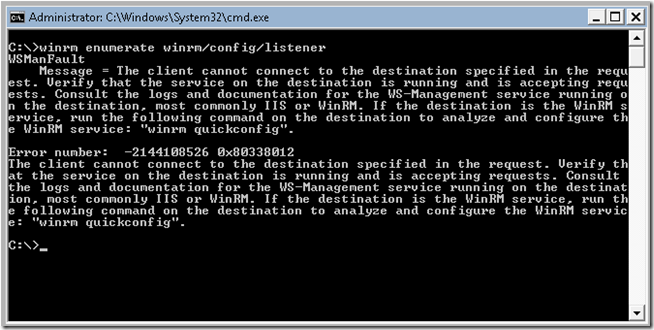
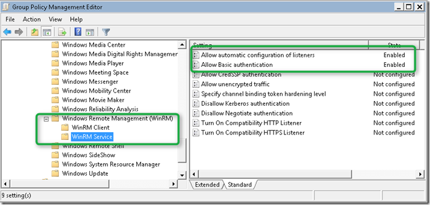
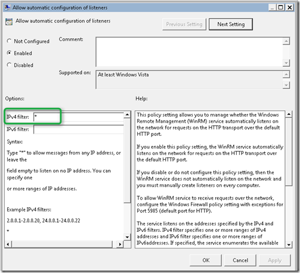
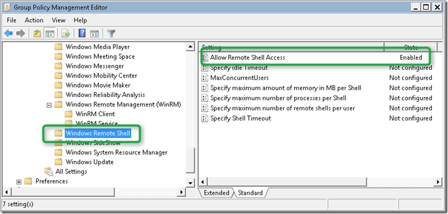
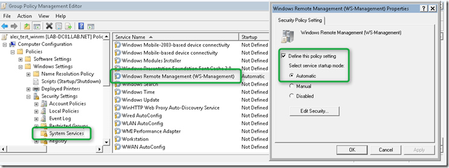
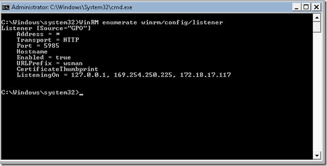
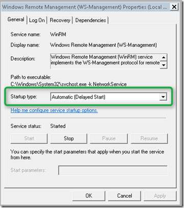
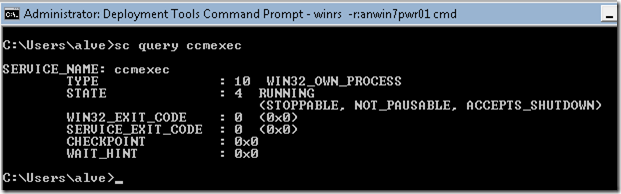

In today’s post I am going to show you how to enable Windows Remote Management through Group Policy.If you haven’t heard of Windows Remote Management yet I recommend you read the articles I have referenced below. When enabled and configured Windows Remote Management provides an easy way for IT Administrators to remotely access and manage Windows Clients and Servers. If you have used the Microsoft Sysinternals [PSTools](http://technet.microsoft.com/en-us/sysinternals/bb896649) suite, you’re going to like this one as well. 

  First let’s take an existing domain joined Windows 7 client that isn’t configured for Windows Remote Management. When we open a command prompt and enter the command WinRM enumerate winrm/config/listener we should get a message as shown in the screenshot below. 

  

  If we wanted to just configure a single system, we could just run the command winrm quickconfig manually to configure WinRM, but if we want to do this on many managed systems, Group Policy is definitely the way to go. So we are going to create a new GPO and under Computer Configuration / Policies / Windows Components / Windows Remote Management (WinRM) / WinRM Service we enable the following settings:

     
- Allow automatic configuration of listeners    
- Allow Basic Authentication 

  

  

  Then under Computer Configuration / Policies / Windows Components / Windows Remote Shell we enable 

     
- Allow Remote Shell Access 

  

  and finally we must also configure the Windows Remote Service to Start Automatically. This is done under Computer Configuration / Windows Settings / Security Settings / System Services.

  

  Once the WinRM configuration settings are applied via Group Policy open a command prompt on the client system and enter the following command: winrm/config/listener the result should be as shown in the screenshot below. 

  

  and the Service is now set to Start Automatically. In fact it’s set to delayed start, this is because by default the DelayedAutoStart key under HKEY_LOCAL_MACHINE\SYSTEM\CurrentControlSet\services\WinRM is already set to 1. 

  

  Now that we have enabled WinRM via Group Policy we can easily manage a system remotely using the WinRS command. The following command opens a command prompt on a remote system. 

  winrs –r:computer01 cmd

  Once a remote connection is established we can just type any command as if we were working on a local computer. Note that you must have WinRM enabled on your management station as well. 

  

  If you plan to enable WinRM within an enterprise environment you probably want to look at the additional settings to fine-tune the WinRM behavior and security.   

  **Additional Information     
**[An Introduction to WinRM Basics](http://blogs.technet.com/b/askperf/archive/2010/09/24/an-introduction-to-winrm-basics.aspx)    
[MSDN Windows Remote Management](http://msdn.microsoft.com/en-us/library/windows/desktop/aa384426(v=vs.85).aspx)    
[What is WinRM? by  Clint Boessen](http://clintboessen.blogspot.com/2010/01/what-is-winrm.html)    
[Windows Management Infrastructure Blog](http://blogs.msdn.com/b/wmi/)

