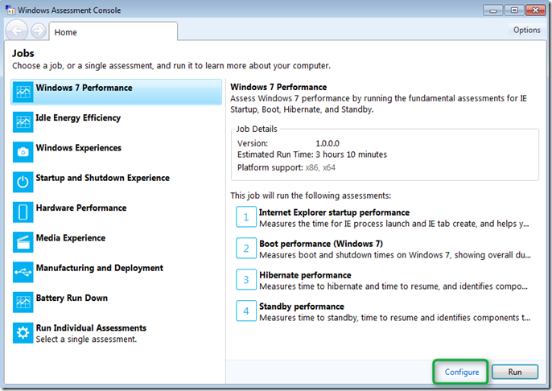
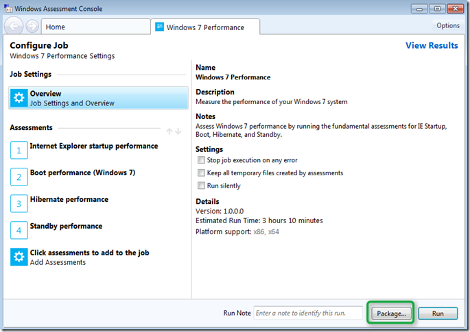
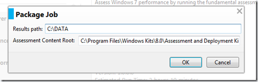
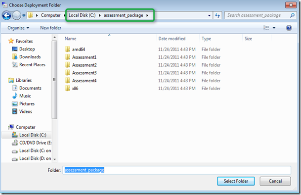
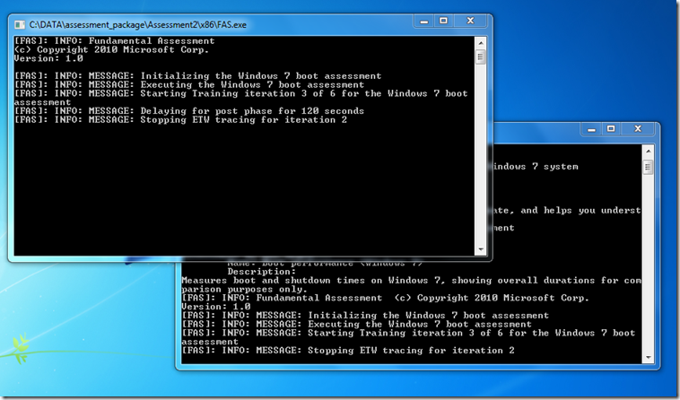
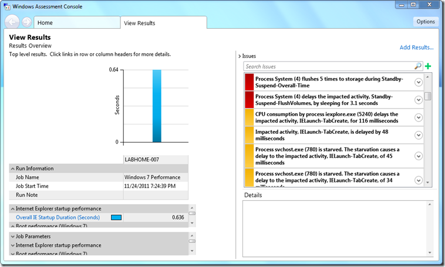
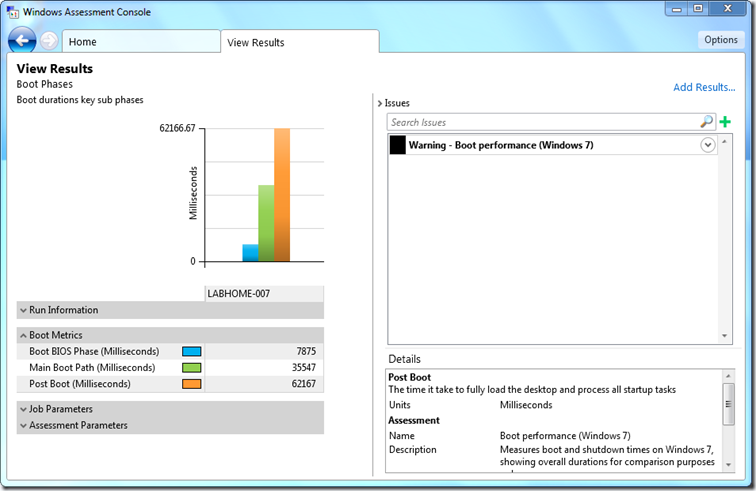

By now most of you have probably looked at the Windows 8 client or server preview build and unfortunately the most attention is given to the new Metro look, but hey there’s more than that coming, in fact there’s some awesome stuff coming I’d like you to know about. With Windows Vista and Windows 7 Microsoft also released the Windows Automated Installation Kit known as WAIK. For Windows 8 this is now being rebranded into Windows Assessment and Deployment Kit in short ADK. Now don’t get confused by the word Assessment here as it has nothing to do with the Microsoft Assessment and Planning Toolkit (MAP) that is used to assess your current infrastructure. 

  The Windows 8 Assessment and Deployment kit is targeted at OEM’s and IT professionals to evaluate overall system performance and for the windows deployment automation. I’ll probably talk about some of the tools included in here later, but for today I’d like to focus on the Windows Performance Assessment that is included within the Windows Assessment solution.

  Those of you who have done Windows Performance analysis before probably know xperf.exe or xbootmgr.exe and its huge number of different command line options for all sorts of things, and once you’ve done your trace reviewing the results is another challenge. If you know what I’m talking about here, then I’m sure you’re going to be a big fan of ADK and the Windows Assessment Console.  I’m still in excitement mode, but this is just awesome!

  Once you have installed the ADK (at present only available for MSDN subscribers) and have selected the Windows Assessment feature during installation, you’ll get the Windows Assessment installed. Now let me show you how easy it is now to prepare, run and review a Windows Performance analysis. 

  First select the Windows 7 Performance Job and the click on the “Configure” button

  

  A second tab is opened where the details of the Job are displayed. As you can see the Windows 7 Performance analysis consists of several assessments that can be further configured, but for now we’ll leave everything default. Since we want to run the performance assessment on another machine click on the “Package” button. 

  

  Specify the Results path

  

  and where the package content is to be stored. 

  

  Then copy the content to a USB disk or directly over to the machine’s local disk that will be used to run the assessment. Because during the assessment the system will reboot several times it’s recommended to enable auto logon on the client. if you don’t want to enable that manually via the registry, use the [Sysinternals Autologon utility](http://technet.microsoft.com/en-us/sysinternals/bb963905) to enable (and later disable) autologon. To start the performance assessment just start the “Run Job.cmd” that is stored within the root of the assessment package folder. Note that by default this job can take up to 3 hours to run. (if you customize the job you can reduce the number of passes etc.). 

  

  after a while………..the Windows Assessment Console will open on the client and you can start reviewing the results. 

  

  

  There is more, much more we can do with the Assessment Console, but let’s leave that for another time. 

  **More Information**

 [Introduction to the Windows Assessment and Deployment Kit](http://www.microsoft.com/download/en/details.aspx?id=27410)   
[Packaging assessments for use on a second computer](http://channel9.msdn.com/Events/BUILD/BUILD2011/HW-976P)   
[Introduction to the Boot Performance Assessment](http://channel9.msdn.com/Events/BUILD/BUILD2011/HW-916P)

