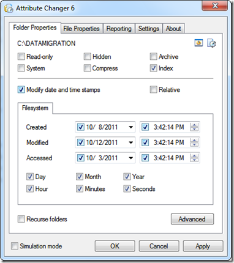

While writing a script that checks the number of days between now and when a particular folder is created I found this Windows Explorer extension called Attribute Changer. Very handy utility when you need to change the creation date of a file or folder to simulate an earlier or later date.  

  Attribute Changer can be downloaded from [here](http://www.petges.lu/products/ac/)

  

