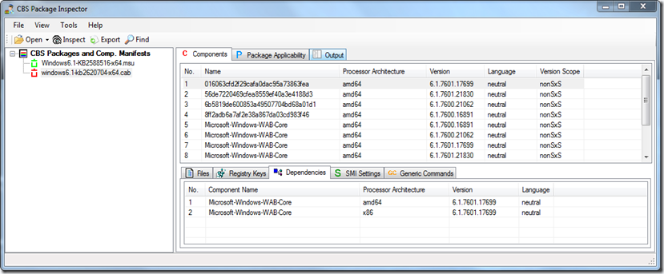

CBS Package Inspector (Package Inspector) is a GUI tool that allows you to open up a Component Based Servicing (CBS) package and view and examine its manifests. In simple words, with this utility you can open and view the content of Microsoft Security Update and QFE packages provided as MUS or a CAB file.

  This tool becomes handy when you need to take a closer look what files or registry settings an update applies.   

  

  The CBS Package Inspector can be downloaded from [here](http://archive.msdn.microsoft.com/packageinspector/Release/ProjectReleases.aspx?ReleaseId=5309)

