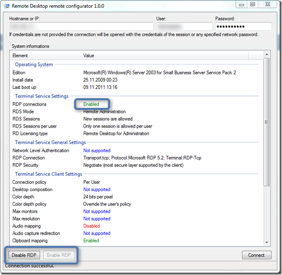

I’ve found another useful utility called RDRemote. The RDRemote Utility allows to enable the Remote Desktop connections from a remote computer using WMI.

  RDRemote can be downloaded from [here](http://rdremote.codeplex.com/)

  

