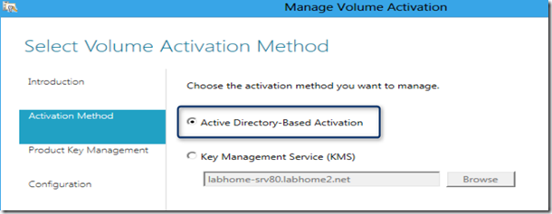
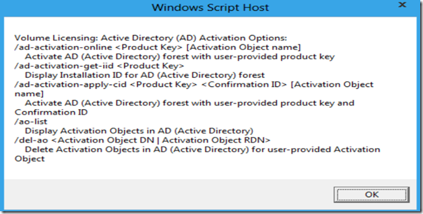

Windows Server 8 comes with a new role called Volume Activation Services. The Volume Activation Service allows IT administrators to enable volume activation for domain joined systems using a Key Management Service Host (KMS) or Active Directory based Activation. This means in theory that going forward there is no need anymore to install and manage a separate infrastructure for volume activation of Windows clients, servers and office, but according to the article “[What’s new in Windows Server 8 Active Directory](http://www.windowsitpro.com/content1/topic/windows-server-8-active-directory-140571/catpath/windowsserver8/page/2)” from the Windows IT Pro magazine KMS will still be required for a while to support everything that uses KMS today, unless Microsoft would provide an update to enable current systems and applications to activate via Active Directory. 

  Once the Volume Activation Services are installed, the required activation method can be selected within the Volume Activation Services configuration wizard. Since I can’t use a production activation key, I wasn’t able to complete the configuration here. 

  

  There is still the slmgr.vbs script that existed already for the management and configuration of KMS, now slmgr.vbs has been extended with additional commands for Activate Directory based activation. 

  

  The below table lists the attributes from the ms-SPP Activation object within Active Directory. 

  **ms-SPP-Activation Object**

              **Attribute**        **Description**        **Details**                  ms-SPP-Config-License        Product-key configuration license used during online/phone activation of the Active Directory forest.        [http://msdn.microsoft.com/en-us/library/windows/desktop/hh446710(v=VS.85).aspx](http://msdn.microsoft.com/en-us/library/windows/desktop/hh446710(v=VS.85).aspx)                  ms-SPP-Confirmation-id        Confirmation ID (CID) used for phone activation of the Active Directory forest        [http://msdn.microsoft.com/en-us/library/windows/desktop/hh446726(v=VS.85).aspx](http://msdn.microsoft.com/en-us/library/windows/desktop/hh446726(v=VS.85).aspx)                  ms-SPP-CSVLK-Partial-Product-Key        Last 5 characters of CSVLK product-key used to create the Activation Object        [http://msdn.microsoft.com/en-us/library/windows/desktop/hh446727(v=VS.85).aspx](http://msdn.microsoft.com/en-us/library/windows/desktop/hh446727(v=VS.85).aspx)                  ms-SPP-CSVLK-Pid        ID of CSVLK product-key used to create the Activation Object        [http://msdn.microsoft.com/en-us/library/windows/desktop/hh446728(v=VS.85).aspx](http://msdn.microsoft.com/en-us/library/windows/desktop/hh446728(v=VS.85).aspx)                  ms-SPP-CSVLK-Sku-id        SKU ID of CSVLK product-key used to create the Activation Object        [http://msdn.microsoft.com/en-us/library/windows/desktop/hh446729(v=vs.85).aspx](http://msdn.microsoft.com/en-us/library/windows/desktop/hh446729(v=vs.85).aspx)                  ms-SPP-Installation-id        Installation ID (IID) used for phone activation of the Active Directory forest        [http://msdn.microsoft.com/en-us/library/windows/desktop/hh446730(v=VS.85).aspx](http://msdn.microsoft.com/en-us/library/windows/desktop/hh446730(v=VS.85).aspx)                  ms-SPP-Issuance-License        Issuance license used during online/phone activation of the Active Directory forest        [http://msdn.microsoft.com/en-us/library/windows/desktop/hh446732(v=VS.85).aspx](http://msdn.microsoft.com/en-us/library/windows/desktop/hh446732(v=VS.85).aspx)                  ms-SPP-KMS-ids        KMS IDs enabled by the Activation Object        [http://msdn.microsoft.com/en-us/library/windows/desktop/hh446734(v=VS.85).aspx](http://msdn.microsoft.com/en-us/library/windows/desktop/hh446734(v=VS.85).aspx)                  ms-SPP-Online-License        License used during online activation of the Active Directory forest        [http://msdn.microsoft.com/en-us/library/windows/desktop/hh446736(v=VS.85).aspx](http://msdn.microsoft.com/en-us/library/windows/desktop/hh446736(v=VS.85).aspx)                  ms-SPP-Phone-License        License used during online activation of the Active Directory forest        [http://msdn.microsoft.com/en-us/library/windows/desktop/hh446738(v=VS.85).aspx](http://msdn.microsoft.com/en-us/library/windows/desktop/hh446738(v=VS.85).aspx)

