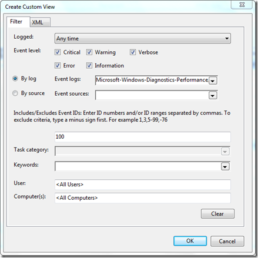
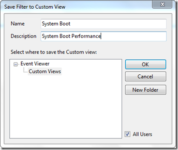
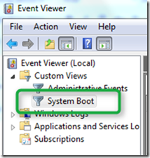
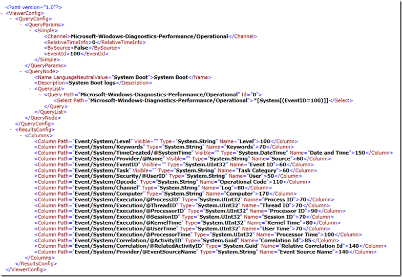
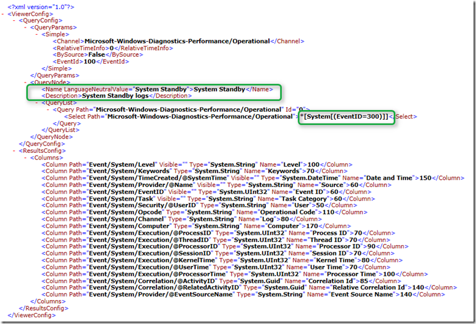

In the past couple of days I have been working on measuring system boot performance and you are probably going to see some posts from me on that subject soon. Today I want to share with you how you can automate the creation of a Windows Eventlog custom view.   

  While running these boot performance tests I reinstalled Windows several times on different systems and each time I wanted to collect the boot performance data from these clients I had to create a custom view within the Windows Event log to filter out the boot events. Well after doing that a few times manually I thought I would be better of to get that thing automated.

  First open the Windows Event log viewer by launching eventvwr.exe then select Custom Views, Create Custom View. Then select the custom view options as shown below. 

   

  When done click on OK. 

  

  Prove a Name and Description and then click OK to save the custom view. 

  

  Then right click on the new created custom view and select Export Custom View and save the custom view XML file to CV_boot.xml. Once saved, you can delete the custom view within the Event log Viewer. 

  

  To recreate the Custom Eventlog View on the same or another system just run the following command:

  eventvwr.exe /v:CV_Boot.xml

  after a view seconds the Eventlog Viewer will open with the new custom view created. And now that we have template we can easily change this easily into a custom view for System Standby. 

  

  Happy Event Viewing!

