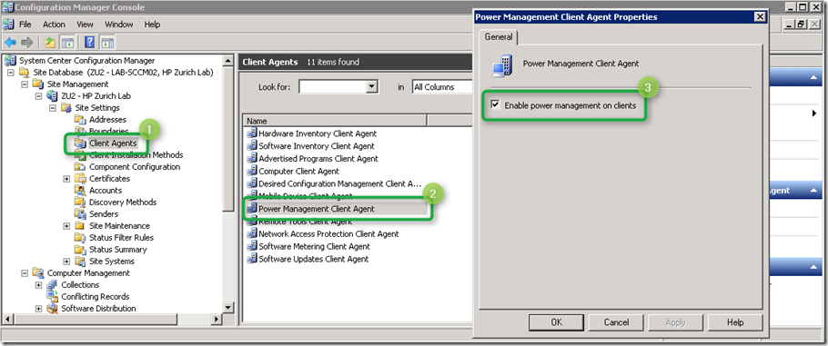
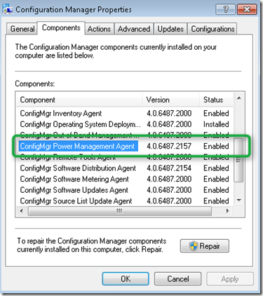
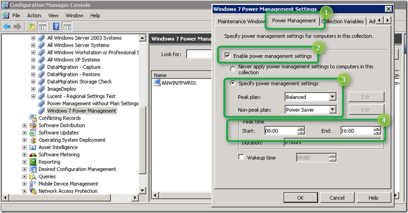
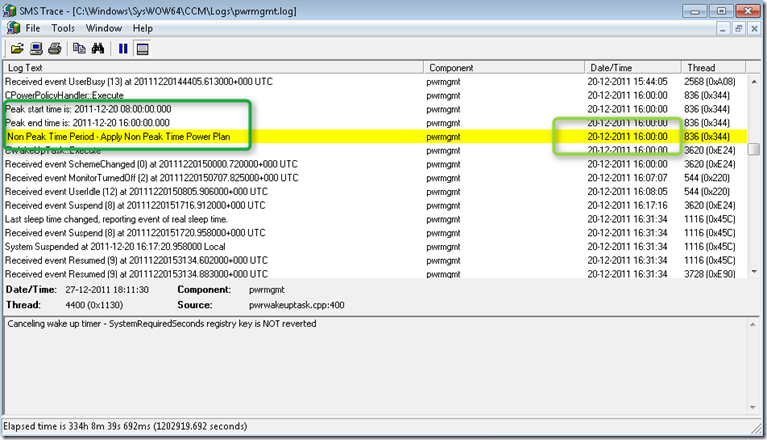
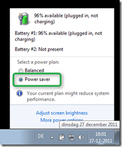
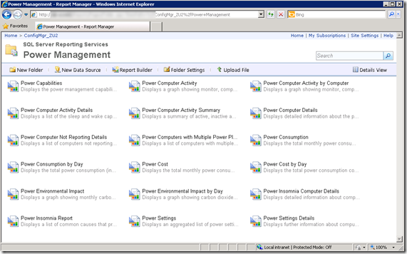

Almost all companies I know do have some sort of a Green-IT policy in place but in my view this should go beyond just putting an e-mail footnote like “*Please consider the environment before printing this e-mail*”. Many companies use Microsoft System Center Configuration Manager 2007 R3, but don’t bail out its Power Management capabilities whereas it could help save energy costs and carbon footprint with just a few clicks.

  So what about a new year’s resolution reducing the carbon footprint so we don’t end up [here](http://www.youtube.com/watch?v=O8qmaAMK4cM) and by doing so you can also help your company saving some big bucks. If you’re curious about how much money you could save, I suggest you download the Energy Start Power Savings Calculator which can be downloaded from [here](http://www.energystar.gov/ia/products/power_mgt/LowCarbonITSavingsCalc_v26_with_5_0v2.xls).

  If you are already running Windows 7 you are already on a good way, this because 2 of the 3 default Power Plans in Windows 7 are [Energy Star compliant](https://www.verboon.info/index.php/2011/11/are-my-windows-power-settings-energy-star-compliant/) namely *Balanced* which is enabled by default and *Power Saver*. The challenge however is that users tend to change the power plan so it meets their personal preferences while at work. Now that’s okay for the working hours but since Windows by itself does not allow a user  to configure  different power plans for peak and non-peak hours that same power plan remains active when they go home but leave their system running.

  Using SCCM 2007 R3 Administrators can define a power plan to be applied for Peak and Non-Peak hours. Now let’s have a look how to enable and configure Power Management within SCCM. If you want to give this a try yourself, make sure that your infrastructure meets the [prerequisites for Power Management](http://technet.microsoft.com/en-us/library/ff977053.aspx).

- Site server must be running Configuration Manager 2007 R3.
- Computers running the Configuration Manager console must have the hotfix KB977384 and Configuration Manager 2007 R3 installed.
- The Configuration Manager 2007 hardware inventory client agent must be enabled for the site on which you are using power management.
- The site must be enabled for power management.
- Hotfix KB977384 must be applied to client computers.

  First enable power management on clients as shown in the below picture.

  

  On the Client within the Configuration Manager properties tab, ConfigMgr Power Management Agent is enabled within the list of components.

  

  I suggest to start with creating a Test Collection and add test clients manually, then configure the Collection Power Management Settings as shown in the picture below.

  

  The next time the SCCM receives it’s policy updates, the Power Management settings should be applied and become active. When we look into the SCCM Power Management log file on the Client we see that at 16:00 the power plan is changed.

  

  The result is that after 16:00 the Power Plan is now set to “Power Saver”.

  

  And finally after a few days (depending on your hardware inventory scanning interval) you should get some data out of the Power Management Reports.

  

  I hope that with this brief overview of the Power Management features within SCCM 2007 R3 was useful to you, if you’re using SCCM consider using this feature, we’re doing it for us today and our next generation tomorrow.

  Power Management with Configuration Manager 2007 R3 Datasheet
[http://download.microsoft.com/download/9/5/8/9585975A-BA17-4029-8265-D0BDB7B4FBF2/SystemCenter_ConfigMgrR3_PowerMgmt_datasheet.pdf](http://download.microsoft.com/download/9/5/8/9585975A-BA17-4029-8265-D0BDB7B4FBF2/SystemCenter_ConfigMgrR3_PowerMgmt_datasheet.pdf)

  Power Management in Configuration Manager 2007 R3
[http://technet.microsoft.com/en-us/library/ff977066.aspx](http://technet.microsoft.com/en-us/library/ff977066.aspx)

  Configure Power Management with SCCM 2007 R3
[http://blogs.technet.com/b/ptsblog/archive/2011/03/08/configure-power-management-with-sccm-2007-r3.aspx](http://blogs.technet.com/b/ptsblog/archive/2011/03/08/configure-power-management-with-sccm-2007-r3.aspx)

  Manage, Monitor, and Report: Implementing a Power Management Strategy with System Center Configuration Manager 2007 R3
[http://technet.microsoft.com/en-us/edge/manage-monitor-and-report-implementing-a-power-management-strategy-with-system-center-configuration-manager-2007-r3.aspx](http://technet.microsoft.com/en-us/edge/manage-monitor-and-report-implementing-a-power-management-strategy-with-system-center-configuration-manager-2007-r3.aspx)

  Power Management in Windows 7 Overview
[http://www.microsoft.com/download/en/details.aspx?id=23878](http://www.microsoft.com/download/en/details.aspx?id=23878)

  Energy Start Power Savings Calculator
[http://www.energystar.gov/ia/products/power_mgt/LowCarbonITSavingsCalc_v26_with_5_0v2.xls](http://www.energystar.gov/ia/products/power_mgt/LowCarbonITSavingsCalc_v26_with_5_0v2.xls)

  IT Power Management Summit: Webinar Presentation Materials
[http://www.energystar.gov/index.cfm?c=power_mgt.pr_power_mgt_summit_materials](http://www.energystar.gov/index.cfm?c=power_mgt.pr_power_mgt_summit_materials)

  Climate Savers Computing
[http://www.climatesaverscomputing.org/](http://www.climatesaverscomputing.org/)

