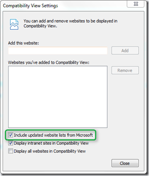
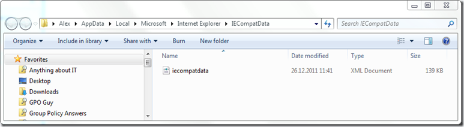
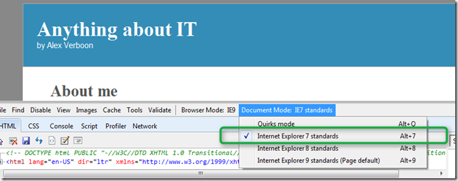
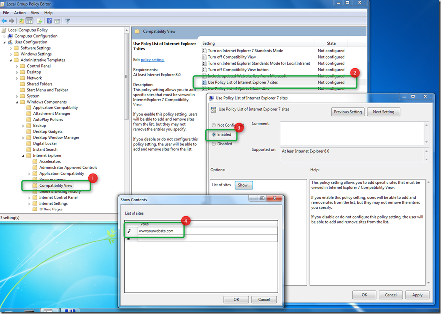

In today’s blog post I’d like to share some basic information I gathered today about the Internet Explorer Compatibility list option that is available within the Compatibility View Settings in Internet Explorer 8 and 9. By default this setting is enabled and causes websites that are listed within the Compatibility list to render properly in newer versions of Internet Explorer. 

  

  When you have the Include updated website lists from Microsoft option enabled, you should have a file called IECompatData.xml stored under %LOCALAPPDATA%\Microsoft\Internet Explorer\IECompatData\

  

  The source list hosted by Microsoft can be found here: [http://ie9cvlist.ie.microsoft.com/ie9CompatViewList.xml](http://ie9cvlist.ie.microsoft.com/ie9CompatViewList.xml)

  So what happens if a website that is listed within the Compatibility list is opened? Well depending on what information is defined within the list e.g. just the domain name or additional attributes Internet Explorer will render the page as specified. The following definitions are possible: 

  <domain>adatum.com</domain>    
<domain docMode="EmulateIE7">fabrikam.com</domain>     
<domain docMode="EmulateIE8">fourthcoffee.com</domain>     
<domain featureSwitch="createElementWithMarkup:false">northwindtraders.com</domain>     
<domain docMode="EmulateIE8" versionVector="8" uaString="8">woodgrovebank.com</domain> 

  For a detailed description read the MSDN Article [Understanding the Compatibility View List](http://msdn.microsoft.com/en-us/library/dd567845(v=vs.85).aspx#structure). When opening a listed website that has the EmulateIE7 attribute set the site will open with IE7 standards. To see the details as shown in the picture below, just press the F12 key to open the Internet Explorer Developer tools. 

  

  So can I add my own site to this list locally? Officially no, because the list gets updated on a regular basis and therefore automatically overwritten, also there is no possibility to get your site added as Microsoft wants to keep the list as small as possible, and therefore only a small number of most frequent visited sites per region are added to the list. 

  To add additional sites to the Compatibility View there are 2 options, either the user adds a site manually or through Group Policy as shown in the picture below.  

  

  Once the GPO is defined, the following registry entries are made. 

  [HKEY_CURRENT_USER\Software\Microsoft\Windows\CurrentVersion\Group Policy Objects\{608F7E92-BF84-40C6-B931-512665E1CA6A}User\Software\Policies\Microsoft\Internet Explorer\BrowserEmulation\PolicyList]   
www.yourwebsite.com=www.yourwebiste.com

  If you’re interested to learn more about Internet Explorer Compatibility I strongly recommend watching / reading the below listed sources:

  Application Compatibility with Internet Explorer 9 Webcast   
[http://technet.microsoft.com/en-us/edge/Video/hh278343](http://technet.microsoft.com/en-us/edge/Video/hh278343)

  How to enable IE Quirks Mode with Group Policy   
[http://www.grouppolicy.biz/2011/05/how-to-enable-ie-quirks-mode-with-group-policy/](http://www.grouppolicy.biz/2011/05/how-to-enable-ie-quirks-mode-with-group-policy/)

  IE Compatibility List Pruning   
[http://blogs.msdn.com/b/ie/archive/2009/07/01/ie-compatibility-list-pruning.aspx](http://blogs.msdn.com/b/ie/archive/2009/07/01/ie-compatibility-list-pruning.aspx)

  A Compatibility View list update is available for Windows Internet Explorer 8: October 25, 2011   
[http://support.microsoft.com/kb/2598845](http://support.microsoft.com/kb/2598845)

  Description of the Compatibility View list in Windows Internet Explorer 8   
[http://support.microsoft.com/kb/960321](http://support.microsoft.com/kb/960321)

  Internet Explorer 9 Compatibility View List   
[http://msdn.microsoft.com/en-us/library/gg622935(v=vs.85).aspx](http://msdn.microsoft.com/en-us/library/gg622935(v=vs.85).aspx)

  Testing sites with Browser Mode vs. Doc Mode   
[http://blogs.msdn.com/b/ie/archive/2010/10/19/testing-sites-with-browser-mode-vs-doc-mode.aspx](http://blogs.msdn.com/b/ie/archive/2010/10/19/testing-sites-with-browser-mode-vs-doc-mode.aspx)

  IE’s Compatibility Features for Site Developers   
[http://blogs.msdn.com/b/ie/archive/2010/06/16/ie-s-compatibility-features-for-site-developers.aspx?Redirected=true](http://blogs.msdn.com/b/ie/archive/2010/06/16/ie-s-compatibility-features-for-site-developers.aspx?Redirected=true)

