In addition to the [Microsoft Security Essentials](http://windows.microsoft.com/en-US/windows/products/security-essentials) software and the [Microsoft Safety Scanner](http://www.microsoft.com/security/scanner/en-us/default.aspx) Microsoft just recently released another FREE antimalware removal product called the [Windows Defender Offline Beta](http://windows.microsoft.com/en-US/windows/what-is-windows-defender-offline). While Security Essentials and Safety Scanner run within Windows, the purpose of the  Windows Defender Offline Tool is to run offline from bootable USB or CD/DVD media. 

  In fact the tool isn’t really something new, those familiar with the Microsoft Desktop Optimization Pack Suite (MDOP) which includes the Diagnostics and Recovery Toolset (DaRT) have probably seen or used  the Standalone System Sweeper tool before. Now when looking at the log files produced by the Windows Defender Offline tool, you’ll notice *Microsoft Standalone System Sweeper tool* entries rather than *Windows Defender Offline*. 

  But let me start now sharing my findings about how the Windows Defender Offline Tool works. First when you go to the [download page](http://windows.microsoft.com/en-US/windows/what-is-windows-defender-offline) you will see two download buttons, one for the 32-bit version and one for the 64-bit version. 

  [
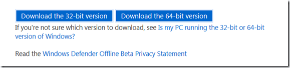
](https://www.verboon.info/wp-content/uploads/2012/01/2012-01-01-23h12_26.png)

  By clicking on one of these buttons, you will not download the tool itself but just the Wizard that helps you preparing the USB or CD/DVD media. When you launch the downloaded executable mssstool32.exe or mssstool64.exe which are self-extracting archives the content is stored in a temporary folder in the root of your system. 

  [
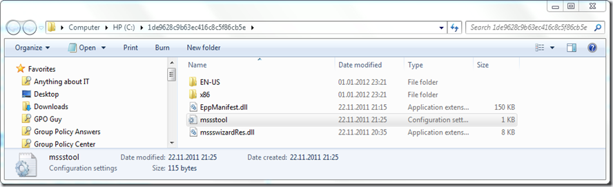
](https://www.verboon.info/wp-content/uploads/2012/01/2012-01-01-23h24_23.png)

  Now whether you download he 32 or 64 bit version, the content of both files is nearly the same except for the file called mssstool.ini 

  mssstool.ini from 32 bit version   
[
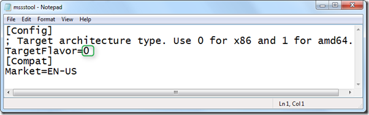
](https://www.verboon.info/wp-content/uploads/2012/01/2012-01-01-23h28_52.png)

  mssstool.ini from 64 bit version   
[
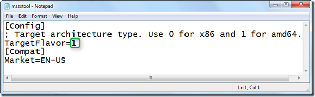
](https://www.verboon.info/wp-content/uploads/2012/01/2012-01-01-23h28_10.png)

  Now let us launch the wizard and see what happens here. 

  [
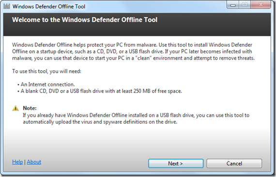
](https://www.verboon.info/wp-content/uploads/2012/01/2012-01-01-23h35_25.png)

  Select USB or ISO file. 

  [
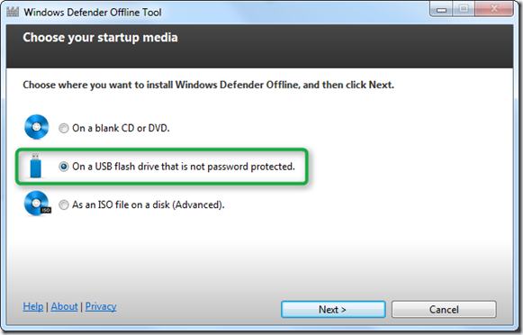
](https://www.verboon.info/wp-content/uploads/2012/01/2012-01-01-23h37_45.png)

  If you selected USB you will be prompted to select the USB drive, if you selected ISO file, you’ll be prompted to specify the location where the ISO file will be stored. 

  [
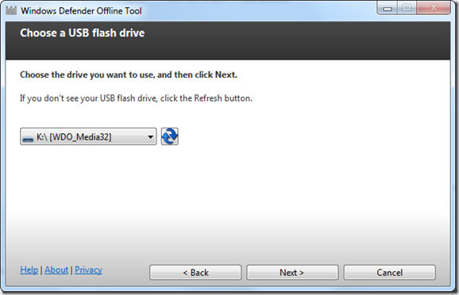
](https://www.verboon.info/wp-content/uploads/2012/01/2012-01-01-23h40_24.png)

  [
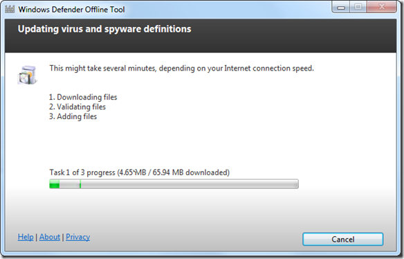
](https://www.verboon.info/wp-content/uploads/2012/01/2012-01-01-23h41_54.png)

  The log file OfflineScan.log stored under C:\ProgramData\Microsoft\Microsoft Standalone System Sweeper Tool\Support tells us what happens here. First the wizard downloads the Windows Defender engine and definition file. When using the 32-bit version it downloads the file mpam-fe.exe from [http://go.microsoft.com/fwlink/?LinkID=209593&clcid=0x409](http://go.microsoft.com/fwlink/?LinkID=209593&clcid=0x409), when using the 64-bit version it downloads the file mpam-fex64.exe from [http://go.microsoft.com/fwlink/?LinkID=216552&clcid=0x409](http://go.microsoft.com/fwlink/?LinkID=216552&clcid=0x409). Next for the 32-Bit version the file imagepackage32.exe is downloaded from [http://go.microsoft.com/fwlink/?LinkId=232568](http://go.microsoft.com/fwlink/?LinkId=232568) or imagepackage64.exe for the 64-bit version from [http://go.microsoft.com/fwlink/?LinkId=232569](http://go.microsoft.com/fwlink/?LinkId=232569)

  Once the files are downloaded the wizard launches the imagepackage32.exe / imagepackage64.exe that contain the WindowsPE source for the corresponding architecture and finally mpam-fe.exe or mpam-fex64.exe is copied to the root of the media. 

  [
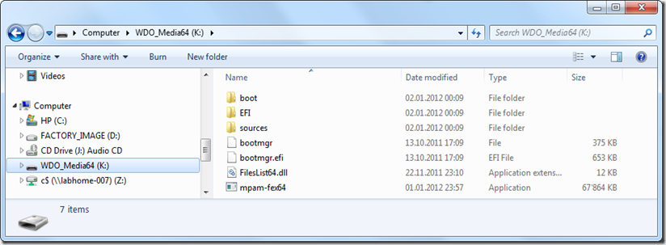
](https://www.verboon.info/wp-content/uploads/2012/01/2012-01-02-00h16_21.png)

  Unfortunately the Windows Defender Offline Beta media preparation wizard does not have an option to add network or storage drivers, but I will show you within one of my next blog posts how you can customize your WDO boot media. 

  [
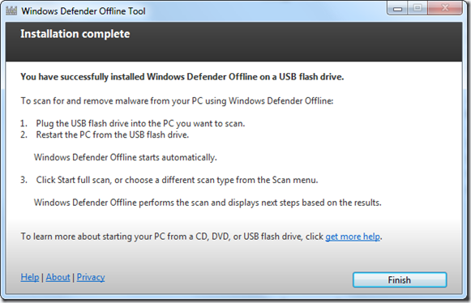
](https://www.verboon.info/wp-content/uploads/2012/01/2012-01-01-23h45_41.png)

  The Windows Defender Offline Beta media is now complete, let’s take a closer look at the content within the boot.wim file that is stored within the Sources folder. You can either mount the boot.wim using imagex.exe or use 7-Zip as explained [here](https://www.verboon.info/index.php/2009/05/browse-and-extract-files-from-a-wim-file-using-7-zip/). The startnet.cmd only contains the *wpeinit* command which instructs WindowsPE to install Plug and Play devices and load network resources. The Winpeshl.ini which is used by winpeshl.exe contains the following command: 

  [LaunchApp]      
AppPath = "%ProgramFiles%\Microsoft Security Client\OfflineScannerShell.exe" 

  [
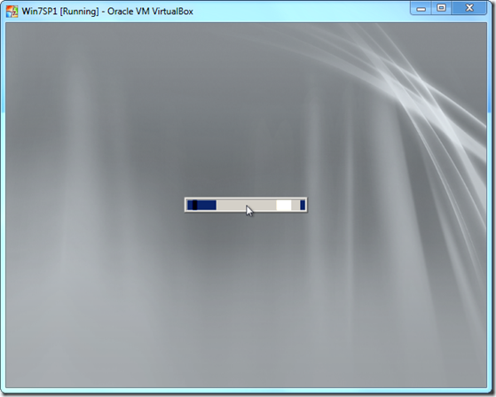
](https://www.verboon.info/wp-content/uploads/2012/01/2011-12-31-13h52_53.png)

  Once WinPE is booted OfflineScannerShell.exe is launched. The OfflineScannerShell.exe then looks for the file mpam-fe.exe or mpam-fex64.exe and extracts the latest engine and definition files used by the Windows Defender Offline tool and finally the Windows Defender Offline tool itself is launched and ready for use. 

  [
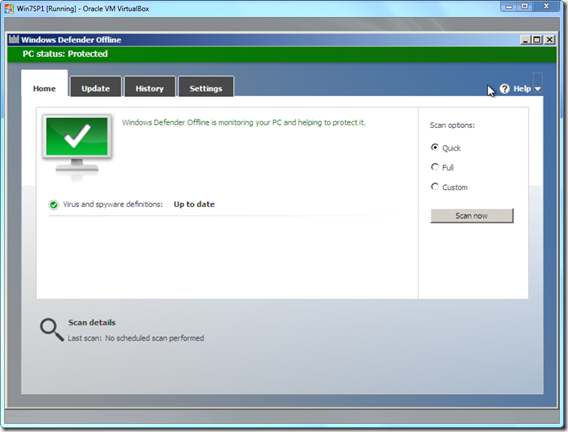
](https://www.verboon.info/wp-content/uploads/2012/01/2011-12-31-13h55_30.png)

  That’s it.

