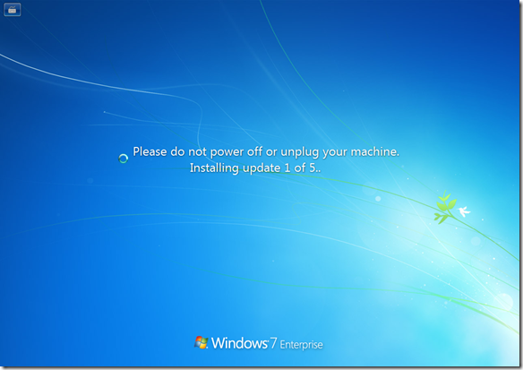
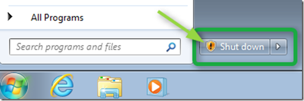
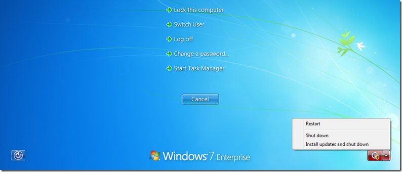

The meeting should have finished since 10 minutes but they keep on talking, you look at your watch and notice that you only have a few minutes until you need to leave the office so that you catch your train. Finally the call ended and you shutdown your machine, but then you get that message “*Please do not power off or unplug your machine. Installing update 1 of 5*”. 

  

  Great, that train is probably going to leave without you. Well if this situation sounds familiar to you, here’s the good news. Next time when there you’re in a hurry before clicking on the Shutdown button have a look if the Button shows the Update sign. 

  

  The update sign indicates that Windows will install pending updates before shutting down. Now if you are in a hurry and want to prevent Windows from installing updates before shutting down, simply press Ctrl+Alt+Delete and then select Shutdown, this will prevent Windows from installing pending updates. 

  

  You’ll never miss a train or plain because of pending Updates.

