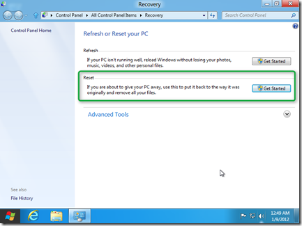
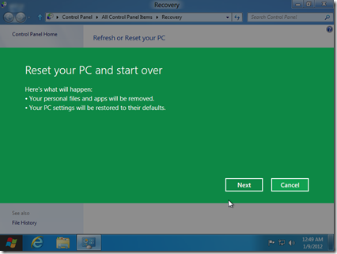
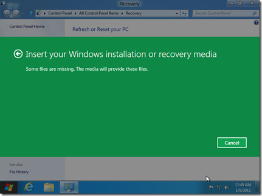
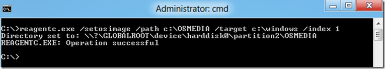
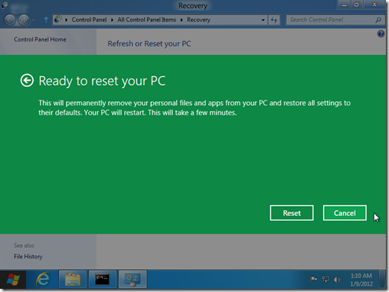
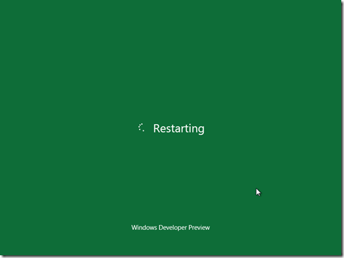
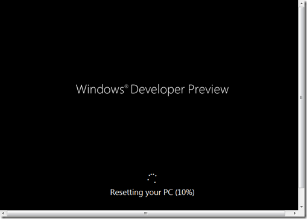

Yesterday I’ve talked about the [Windows 8 Refresh Your PC feature](https://www.verboon.info/index.php/2012/01/the-windows-8-refresh-your-pc-feature/), today I’d like to show how you can reset Windows 8 without using external media. When performing a Reset on a Windows 8 client, you are going to run a complete fresh installation of Windows 8 without preserving any user data or settings. You would use this option before you give back your system to anyone else and want to make sure that there is no personal data or settings left on the system. 

  

  Like the Refresh Your PC option, the Reset your PC feature can be launched from within a running Windows or from the Recovery Console. In this example I am going to launch it from within a running Windows. 

  

  Now unless you have the Windows 8 installation media still inserted / attached to your system, Windows 8 is going to ask you to insert them before it can continue the process. 

  

  Now here’s a little trick how you can prevent Windows 8 from asking for the external media, just in case you don’t have the media available all the time. 

     
- Open an elevated prompt and create a folder called **C:\OSMEDIA**    
- Then copy the** install.wim** file from the Windows Installation media Sources folder to **C:\OSMEDIA**    
- Then enter the following command:     
reagentc.exe /setosimage /path C:\OSMEDIA /target c:\Windows /Index 1       
    
- you should see the following message     
      
      
    
- When you type reagentc.exe /info you’ll get the following result:      
      
Extended configuration for the Recovery Environment        Windows RE enabled:   1       
    Windows RE  staged:   0        
    **Setup enabled:        1**        
    User Wim enabled:     0        
    Custom Recovery Tool: 0        
    WinRE.WIM directory:  
    Recovery Environment: \\?\GLOBALROOT\device\harddisk0\partition1\Recovery\9dc3306c-3af5-11e1-8249-c48e1fe82496        
    BCD Id:               9dc3306c-3af5-11e1-8249-c48e1fe82496        
   ** Os recovery image:    \\?\GLOBALROOT\device\harddisk0\partition2\OSMEDIA**        
    **Os image index:       1**        
    User image:           
    User image index:     0    
    Recovery Operation:   4        
    Operation Parameter:  
    Boot Key Scan Code    0x0        
REAGENTC.EXE: Operation successful

 

  Now the next time you start the Reset Your PC feature, Windows won’t prompt you to insert the media but use the sources provided locally. 

  

  

  

  Hope you found this useful, stay tuned, there’s more coming.

