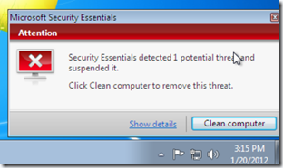
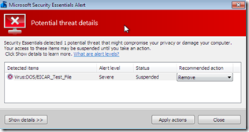

I was doing some Antivirus stuff this afternoon now let me share with you how to test if your Antivirus program is working, e.g. alerts you in the event of a virus. Of course you can go to certain places on the internet where it won’t take long until you get a real virus, but that’s probably not what you want to do, so here’s a brief description how to use the “Test-Virus”. 

     
- Go to the eicar (European Institute for Computer Antivirus Research) website [http://www.eicar.org/86-0-Intended-use.html](http://www.eicar.org/86-0-Intended-use.html) and read the details       
    
- Open notepad and paste the content of the test file, then save the file      
    
- Your Antivirus program should now bring an alert  

  

  

