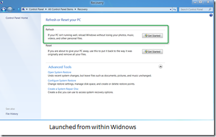
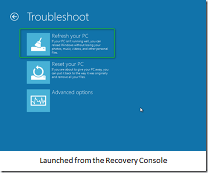
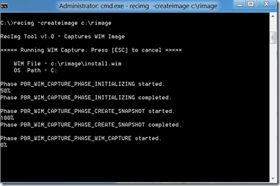
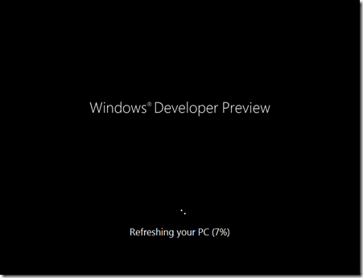
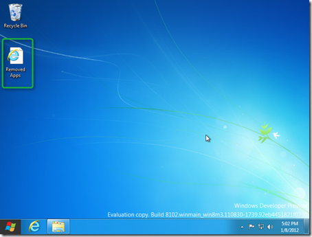
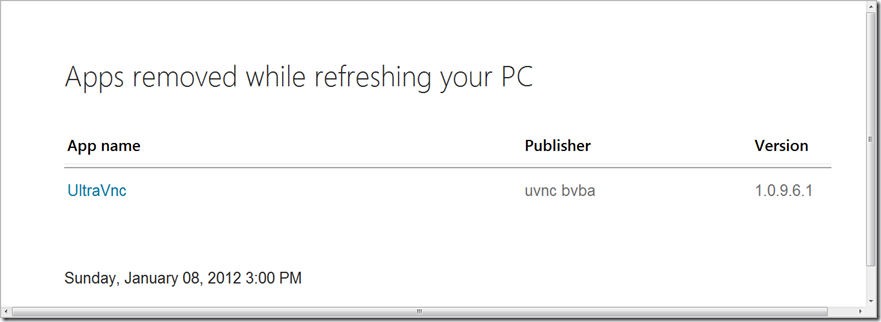

As recently illustrated on the Windows 8 Build blog Windows 8 comes with new features to [Reset or Refresh your PC](http://blogs.msdn.com/b/b8/archive/2012/01/04/refresh-and-reset-your-pc.aspx). The Reset Feature basically triggers a complete new installation of Windows 8 without taking care of any personal data hence this option should only be used when you have your data backed up already or when you intend to hand-out the system to someone else and you want to ensure that the system doesn’t have any personal data or settings stored. The Refresh option allows you to re-install Windows 8 but it will take care of your personal data, settings and Metro Style applications e.g. once the Windows 8 operating system installation has completed the user will still have access to his data and personalization settings. Furthermore the Refresh Your PC feature allows you not just to install a clean version of Windows 8 but one that does already include some of your self-installed applications so that you don’t have to install them all from scratch again. 

  The Refresh Feature can be accessed in two ways, either from a running Windows by selecting the Recovery options or from the Recovery Environment. 

  

  

  But before you can actually use he Refresh My PC feature, you must first create a custom image that serves as the baseline when refreshing your PC. For Home Computers it’s probably best to to this right after you have completed installing your applications and customized your system to your needs. I am not sure if the Refresh Your PC feature will also be suitable for Enterprise environments where usually computers are joined to a domain and I could imagine that there might be an issue with domain authentication e.g. the computer might have to be re-joined to the domain after the system has been refreshed. (I’ll add this to my “to look at list” and might come back with this in a later post). 

  To create an image that will be used by the Refresh Your Computer feature, open an elevated command prompt and then enter the following commands: 

  **mkdir C:\RIMAGE**

  **recimg -CreateImage C:\RIMAGE**

  Depending on the size of your OS, installed features and applications, this process can take a while. 

  

  As mentioned in the Windows 8 build blog, recimg.exe creates an image and then registers the image so it can be used by the Refresh Your PC feature. Since the image will be stored on the local drive make sure that you have enough disk space available. So what does **registering** mean? Those of you already familiar with the Windows recovery environment probably know the reagentc.exe tool that ships with the Windows operating system. When executing reagentc.exe /info on a clean machine the output is as following: 

  Extended configuration for the Recovery Environment

      Windows RE enabled:   1     
    Windows RE  staged:   0      
    Setup enabled:        0      
    User Wim enabled:     0      
    Custom Recovery Tool: 0      
    WinRE.WIM directory:  
    Recovery Environment: \\?\GLOBALROOT\device\harddisk0\partition1\Recovery\0ded5bed-3a44-11e1-9efd-fb0fdc966529      
    BCD Id:               0ded5bed-3a44-11e1-9efd-fb0fdc966529      
    Os recovery image:    
    Os image index:       0      
    User image:           
    User image index:     0    
    Recovery Operation:   4      
    Operation Parameter:  
    Boot Key Scan Code    0x0      
REAGENTC.EXE: Operation successful

  When running reagentc.exe /info on a system where recimg.exe completed successfully the output looks as following: 

  Extended configuration for the Recovery Environment

      Windows RE enabled:   1     
    Windows RE  staged:   0      
    Setup enabled:        0      
    User Wim enabled:     1      
    Custom Recovery Tool: 0      
    WinRE.WIM directory:  
    Recovery Environment: \\?\GLOBALROOT\device\harddisk0\partition1\Recovery\0ded5bed-3a44-11e1-9efd-fb0fdc966529      
    BCD Id:               3f82e61a-df46-11e0-a3e7-8fbeddb01d29      
    Os recovery image:    
    Os image index:       0        
    User image:           \\?\GLOBALROOT\device\harddisk0\partition2\rimage      
    User image index:     1    
    Recovery Operation:   4      
    Operation Parameter:  
    Boot Key Scan Code    0x0      
REAGENTC.EXE: Operation successful

  When launching the Refresh Your PC option the system will reboot into the Recovery Environment and apply the image you’ve previously created. 

  

  Once the system is re-installed, you’ll notice a shortcut on the Desktop called “**Removed Apps**”. 

  

  The shortcut points to a HTML file that lists all the applications that you will need to re-install, this because as mentioned above and explained in detail within the Windows 8 Build blog [article](http://blogs.msdn.com/b/b8/archive/2012/01/04/refresh-and-reset-your-pc.aspx) traditional applications, so non-Metro Style applications are not preserved when refreshing the system. 

  

  When looking at the root of the system drive you’ll notice that (if you enable showing the hidden items) that there is a folder called $SysReset and a folder called Widnows.old. The Windows.old folder can be removed manually using the Disk Cleanup utility. The $SysReset folder is not removed but I would consider that being the case with the final release of Windows 8.  

  If I consider the amount of effort I had just recently re-installing 2 of our family systems with Windows 7, this is definitely a great time saving feature and allows you to blow new life into your system that might have ended up becoming slowly over time.

