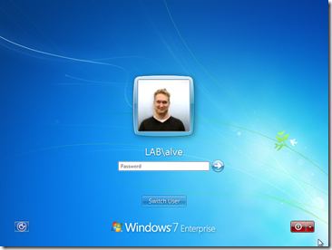
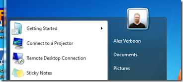

Back in august 2011 I wrote about a utility called [AD Photo Edit](https://www.verboon.info/index.php/2011/08/tooltip-ad-photo-edit/) which allows you to upload your personal picture into Active Directory. Today I want to share with you another utility I came across called ADUserTile. 

  ADUserTile checks if you have a picture stored within the Active Directory thumbnailPhoto attribute and sets that picture as your profile picture within Windows 7 so it becomes visible at the logon screen and the Windows Desktop. 

  

  

      ADUserTile is free and can be downloaded from [here](http://adusertile.codeplex.com/). Also read documentation [here](http://adusertile.codeplex.com/documentation) on how to integrate ADUserTile within a GPO so that the tool runs automatically at user logon.

