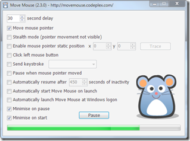

Here’s a tool that has came in handy for me during the past 3 days, so let me share this one with you. Move Mouse is a simple application that generates mouse activity. You can either move the mouse pointer, click the left mouse button, send a keystroke, or any combination of the three.

  

  For more details and download  go to the Codeplex project page [here](http://movemouse.codeplex.com/).

