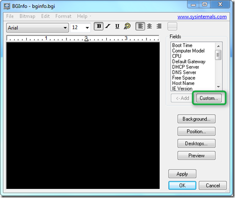
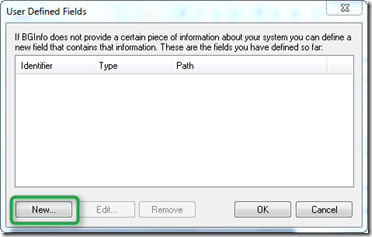
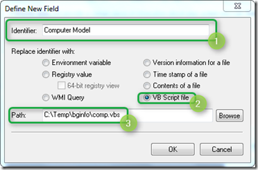
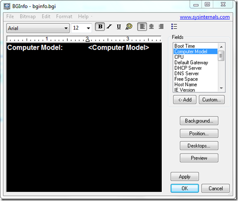
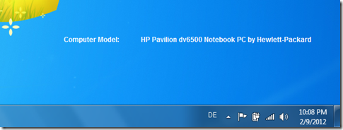

Out of the box [BGINFO](http://technet.microsoft.com/en-us/sysinternals/bb897557) includes a number of predefined fields that can be used to display information on the desktop such as Computer name, IP Address etc. But if the standard fields aren’t enough,BGINFO allows creating custom fields that can pull data from various sources like WMI, Registry, File content, Environment variables or VBScript. 

  The below example shows how to embed VBSCRIPT code output in BGINFO. First we create a VBSCRIPT file called **comp.vbs** that has the following content. (Credit for the script goes to [Moral Volcano](http://www.vsubhash.com/article.asp?MV-RFM-IE=on&id=96&info=Moral_Volcano’s_VBScript_Add_Ons_for_Microsoft_BgInfo))

  winmgt = "winmgmts:{impersonationLevel=impersonate}!//"      
Set oWMI_Qeury_Result = GetObject(winmgt).InstancesOf("Win32_ComputerSystem")

  For Each oItem In oWMI_Qeury_Result      
Set oComputer = oItem       
Next

  If IsNull(oComputer.Model) Then      
  sComputerModel = "*no-name* model"       
Else       
  If LCase(oComputer.Model) = "system product name" Then       
    sComputerModel =  "Custom-built PC"       
  Else       
    sComputerModel =  oComputer.Model       
  End If       
End If

  If IsNull(oComputer.Manufacturer) Then      
  sComputerManufacturer = "*no-name* manufacturer"       
Else       
  If LCase(oComputer.Manufacturer) = "system manufacturer" Then       
    sComputerManufacturer =  "some assembler"       
  Else       
    sComputerManufacturer =  oComputer.Manufacturer       
  End If       
End If

  sComputer = Trim(sComputerModel) & " by " & Trim(sComputerManufacturer)      
Echo sComputer

  If you were to launch this script, you will get an error message saying that there is a type mismatch, this is caused by the line that starts with the word **Echo **because *Echo* is not a valid vbscript command, normally you would use the *wscript.echo* command. But for the use with BGINFO we must use the above syntax as this is what gets parsed back to BGINFO

  So whenever you create a vbscript that is used with BGINFO you must include the command *Echo* <*variable to return*>

  Then we open BGINFO and follow the steps as illustrated below. 

  

  

  

  

  When done we’re saving the configuration, in this case to bginfo.bgi. And finally we launch BGINFO using the following command line. 

  "BgInfo.exe" "bginfo.bgi" /timer:0 /silent /nolicprompt

  and get the following result. 

  

  If you’re looking for more ideas I recommend you have a look at the BgInfo VBScript Add-On scripts created by Moral Volcano [here](http://www.vsubhash.com/article.asp?MV-RFM-IE=on&id=96&info=Moral_Volcano’s_VBScript_Add_Ons_for_Microsoft_BgInfo).

