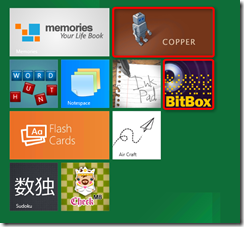
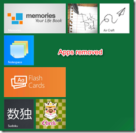
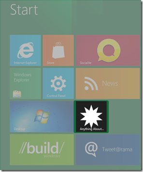

As mentioned in my earlier post [Windows 8 – What’s new in the Deployment Image Servicing and Management tool (DISM)](https://www.verboon.info/index.php/2012/01/windows-8-whats-new-in-the-deployment-image-servicing-and-management-tool-dism/) the DISM tool now also contains commands for managing metro style applications. When running dism.exe /online /? we find the following APPX servicing commands. 

     
- **/Remove-ProvisionedAppxPackage** - Removes AppX packages from the image. AppX packages will not be installed when new user accounts are created.    
- **/Add-ProvisionedAppxPackage** - Adds AppX packages to the image and sets them to install for each new user.    
- **/Get-ProvisionedAppxPackages** - Displays information about AppX packages in an image that are set to install for each new user. 

  **Listing Provisioned Metro Style Applications**

  When running the command DISM.EXE /Online /Get-ProvisionedAppxPackages we get a list of all metro style applications that are installed for each new user.. 

  Deployment Image Servicing and Management tool     
Version: 6.2.8102.0

  Image Version: 6.2.8102.0

  Getting the list of 3rd party AppX packages in this image...

  DisplayName : microsoft.alarms     
Version : 1.0.0.40      
Architecture : neutral      
ResourceId : neutral      
PackageName : microsoft.alarms_1.0.0.40_neutral_neutral_8wekyb3d8bbwe

  DisplayName : microsoft.audiotagpiano     
Version : 1.2.1.8      
Architecture : neutral      
ResourceId : neutral      
PackageName : microsoft.audiotagpiano_1.2.1.8_neutral_neutral_8wekyb3d8bbwe

  DisplayName : microsoft.bitbox     
Version : 1.0.0.11      
Architecture : neutral      
ResourceId : neutral      
PackageName : microsoft.bitbox_1.0.0.11_neutral_neutral_8wekyb3d8bbwe

  DisplayName : microsoft.build     
Version : 1.0.1.4      
Architecture : neutral      
ResourceId : neutral      
PackageName : microsoft.build_1.0.1.4_neutral_neutral_8wekyb3d8bbwe

  DisplayName : microsoft.checkm8     
Version : 1.0.60819.0      
Architecture : neutral      
ResourceId : neutral      
PackageName : microsoft.checkm8_1.0.60819.0_neutral_neutral_8wekyb3d8bbwe

  DisplayName : microsoft.copper     
Version : 1.0.0.27      
Architecture : x86      
ResourceId : neutral      
PackageName : microsoft.copper_1.0.0.27_x86_neutral_8wekyb3d8bbwe

  *To keep this blog post short, I have shortened the list*    

   **Removing Provisioned Metro Style Applications**

  To prevent a metro style application being installed for new users the command DISM.EXE /Online /Remove-ProvisionedAppxPackage is used. 

  DISM.EXE /Online /Remove-ProvisionedAppxPackage /PackageName:microsoft.bitbox_1.0.0.11_neutral_neutral_8wekyb3d8bbwe     
DISM.EXE /Online /Remove-ProvisionedAppxPackage /PackageName:microsoft.copper_1.0.0.27_x86_neutral_8wekyb3d8bbwe

   

  **Adding Metro Style Applications**

  To add metro style application we use the command DISM.EXE /Online /Add-ProvisionedAppxPackage 

  DISM.EXE /Online /Add-ProvisionedAppxPackage /PackagePath:C:\data\MetroApp01_1.0.0.3_AnyCPU_Debug_Test\MetroApp01_1.0.0.3_AnyCPU_Debug.appx /SkipLicense

  

  When running DISM.EXE /Online /Get-ProvisionedAppxPackages again, we see the entry for the new added metro style app. 

  DisplayName : anythingaboutit.meet.metro   
Version : 1.0.0.3    
Architecture : neutral    
ResourceId : neutral    
PackageName : anythingaboutit.meet.metro_1.0.0.3_neutral_neutral_5gyrq6psz227t

