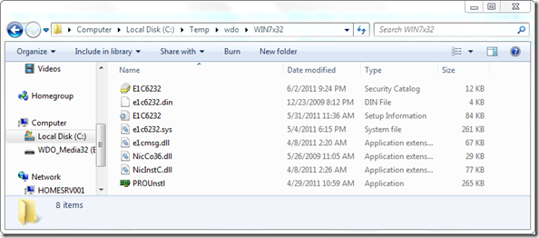
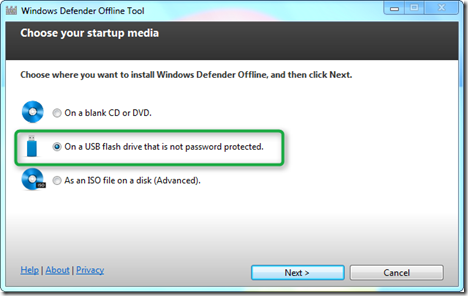
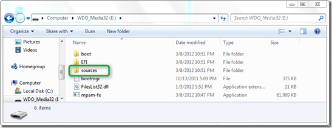
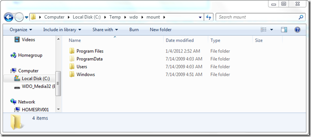
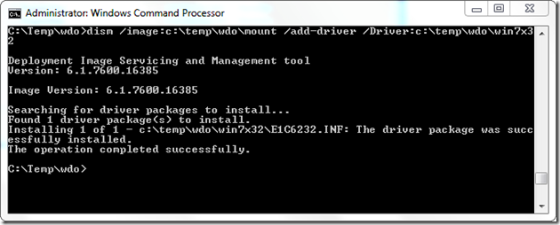
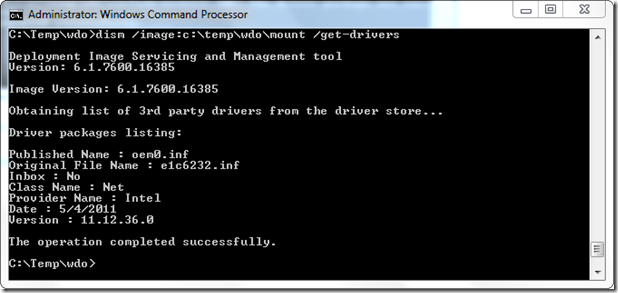

Back in January I wrote a post about [how the Windows Defender Offline Beta Tool works](https://www.verboon.info/index.php/2012/01/how-the-windows-defender-offline-beta-tool-works/) and mentioned that the preparation wizard does not have an option to inject drivers. This can be a problem when WinPE does not recognize the disk or when you wish to have network connectivity. I had promised to explain how to add drivers to the Windows Defender Offline Beta tool, but actually forgot about writing a follow up post until I was kindly reminded by a blog reader to do so.

  In fact this has not so much to do with the WDO Tool itself, as this is just about updating WinPE from where WDO is executed. The below instructions were created on a Windows 7 32 bit client, but will also work on Windows 7 64 bit and the Windows 8 Consumer preview builds.

  First make sure you have the drivers ready you wish to inject. Note that if you are running a 64 bit version of Windows, you also need the 64 bit drivers and when running a 32 bit version the 32 bit version drivers. Store the downloaded drivers to your local disk. In this case I have stored the Intel network card drivers for the HP 8460p notebook under C:\Temp\WDO\Win7x32

  

  Then if you haven’t done so already, download the WDO Tool from [here](http://windows.microsoft.com/en-US/windows/what-is-windows-defender-offline) and then launch the wizard and select the USB option.

  

  When completed, the WDO Tool content is stored on the USB flash disk. The content should look as following.

  

  When navigating to the **Sources** folder you should find a file called **BOOT.WIM**. Copy this file to your local disk. In this example I am copying the file to C:\Temp\WDO\boot.wim. (You could leave the file on the flash drive but editing the WIM file on the local disk is probably faster). Next create a folder called **Mount**, we will use this folder to mount the content of the boot.wim file using the following command that we execute in an elevated command prompt.

  dism.exe /mount-wim /wimfile:c:\temp\wdo\boot.wim /index:1 /MountDir:c:\temp\wdo\mount

  Wait until the command completes and then if everything went fine, you should see the mounted content like this.

  

  Then run the following command:

  dism /image:c:\temp\wdo\mount /add-driver /Driver:c:\temp\wdo\win7x32

  

  To double check the driver install type the following command:

  dism /image:c:\temp\wdo\mount /get-drivers

  

  To commit the changes and unmount the boot.wim run the following command:

  dism.exe /Unmount-Wim /Mountdir:c:\temp\wdo\mount /commit

  Wait until the unmount command completes and then copy the BOOT.WIM located in c:\temp\wdo\ back into the Sources folder on the USB flash drive. The drivers are now added and depending on what type of drivers you added, network or disk access should now be possible.

