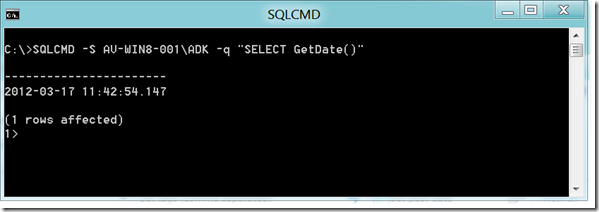

In the days that I was an Oracle database admin (long long time ago) the two most important applications I used to manage a database were [SQLNet](http://www.orafaq.com/wiki/SQL*Net) and [SQL Plus](http://www.orafaq.com/wiki/Sqlplus). SQL-Net for providing database connectivity and SQL Plus as the command line interface. For Microsoft SQL Server the kind of equivalent to Oracle’s SQL Plus is [SQLCMD](http://msdn.microsoft.com/en-us/library/ms162773.aspx). But for a long time this utility was only available with a full SQL Server installation or as part of the SQL Server Admin Studio install. 

  But this week, I found out that as part of the [Microsoft® SQL Server® 2008 R2 Feature Pack](http://www.microsoft.com/download/en/details.aspx?id=16978), SQLCMD is available as a separate download. So if you get along with just the command line interface all you need to remotely manage an SQL Server Database is to install SQLCMD and the SQL Native Client. 

  

   

  **Microsoft® SQL Server® 2008 R2 Command Line Utilities **

  The SQLCMD utility allows users to connect to, send Transact-SQL batches from, and output rowset information from SQL Server 7.0, SQL Server 2000, SQL Server 2005, and SQL Server 2008 and 2008 R2 instances. The bcp utility bulk copies data between an instance of Microsoft SQL Server 2008 R2 and a data file in a user-specified format. The bcp utility can be used to import large numbers of new rows into SQL Server tables or to export data out of tables into data files.   
**Note:** This component requires both **[Windows Installer 4.5](http://go.microsoft.com/fwlink/?LinkId=123373)** and **Microsoft SQL Server Native Client** (which is another component available from this page).     
Audience(s): **Customer, Partner, Developer**    **[X86 Package](http://go.microsoft.com/fwlink/?LinkID=188429&clcid=0x409)**(SqlCmdLnUtils.msi)      
**[X64 Package](http://go.microsoft.com/fwlink/?LinkID=188430&clcid=0x409)** (SqlCmdLnUtils.msi)      
**[IA64 Package](http://go.microsoft.com/fwlink/?LinkID=188431&clcid=0x409)**(SqlCmdLnUtils.msi)

 

   

  **Microsoft® SQL Server® 2008 R2 Native Client**

  Microsoft SQL Server 2008 R2 Native Client (SQL Server Native Client) is a single dynamic-link library (DLL) containing both the SQL OLE DB provider and SQL ODBC driver. It contains run-time support for applications using native-code APIs (ODBC, OLE DB and ADO) to connect to Microsoft SQL Server 2000, 2005, or 2008. SQL Server Native Client should be used to create new applications or enhance existing applications that need to take advantage of new SQL Server 2008 R2 features. This redistributable installer for SQL Server Native Client installs the client components needed during run time to take advantage of new SQL Server 2008 R2 features, and optionally installs the header files needed to develop an application that uses the SQL Server Native Client API.   
Audience(s): **Customer, Partner, Developer**    **[X86 Package](http://go.microsoft.com/fwlink/?LinkID=188400&clcid=0x409)** (sqlncli.msi)      
**[X64 Package](http://go.microsoft.com/fwlink/?LinkID=188401&clcid=0x409)** (sqlncli.msi)      
**[IA64 Package](http://go.microsoft.com/fwlink/?LinkID=188402&clcid=0x409)** (sqlncli.msi)

