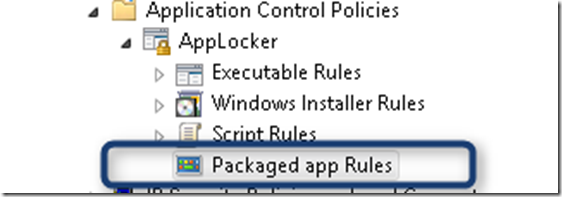
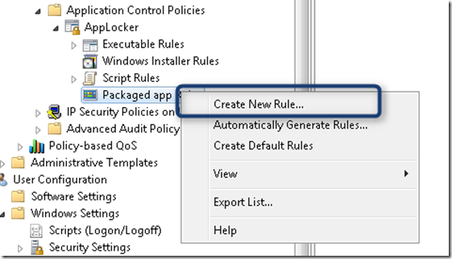
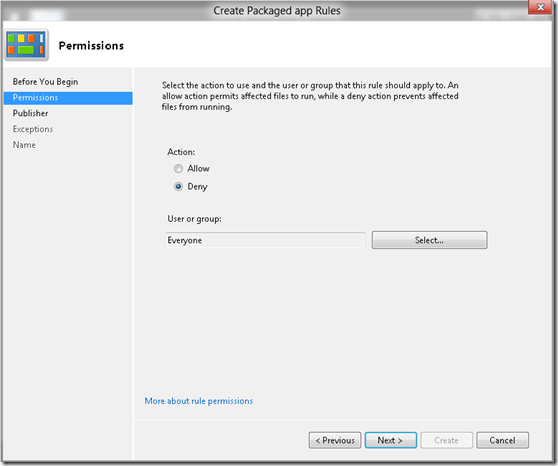
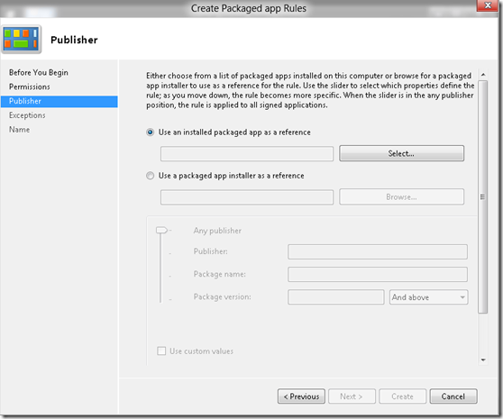
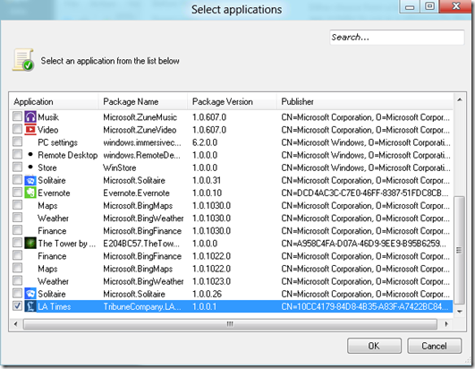
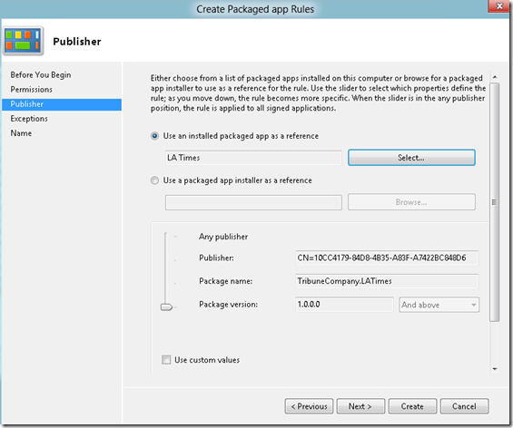
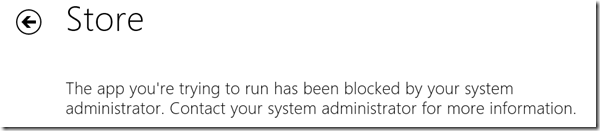

In Windows 8 the Applocker feature has been extended to support management of metro style apps. Enterprise administrators can define a Packaged app Rule to allow or deny the installation and/or use of a particular metro style app. When opening the Group Policy editor under Computer Configuration / Windows Settings / Security Settings / Application Control Settings / Applocker there is a new node called Packaged app Rules. 

   

  To create a new rule, right click on the Packaged app Rules and select Create New Rule…

  

  Select “**Deny**” and then Next. 

  

  Select “**Use an installed packaged app as a reference**”. Note to prevent the installation of an app, you can select the packaged app installer as a reference too. 

  

  Select the application, then confirm with **OK**. 

  

  Then click “**Create**” to create the new Rule. 

  

  When a user attempts to launch this metro style application, the following message appears. 

   

  

  **Additional Resources:**

  [Packaged apps and Packaged app installer rules in AppLocker](http://technet.microsoft.com/en-us/library/hh831350.aspx)

