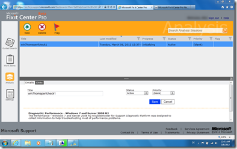
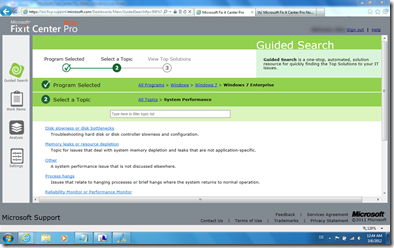

If you haven’t heard of this yet, I recommend taking a look at recently launched **Microsoft Fixit Center Pro (Beta).** This is an online service developed by the Microsoft Customer Service and Support organization that can help you with troubleshooting problems. 

  To learn more about Microsoft Fixit Center Pro, I recommend reading the following: 

  [Microsoft Fix it Center Pro Now Available!](http://blogs.technet.com/b/fix_it_center_pro_blog/archive/2012/02/28/microsoft-fix-it-center-pro-now-available.aspx)    
[Microsoft Fix it Center Pro automated diagnostic portal](http://support.microsoft.com/kb/2672837)

    

   

