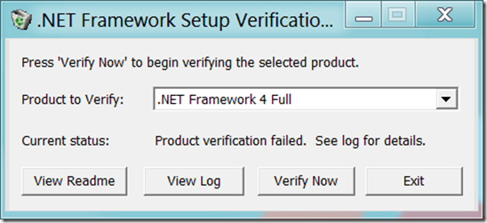
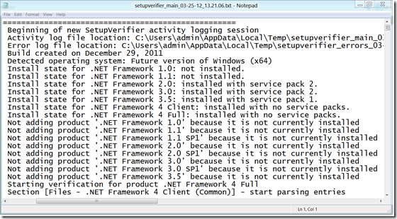

This .NET Framework setup verification tool is designed to automatically perform a set of steps to verify the installation state of one or more versions of the .NET Framework on a computer.  It will verify the presence of files, directories, registry keys and values for the .NET Framework.  It will also verify that simple applications that use the .NET Framework can be run correctly.

  More details and download links can be found on Aaron Stebner’s blog [here](http://blogs.msdn.com/b/astebner/archive/2008/10/13/8999004.aspx)

  

  

