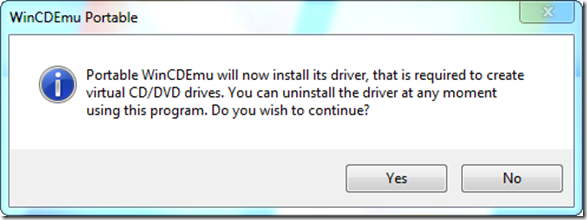
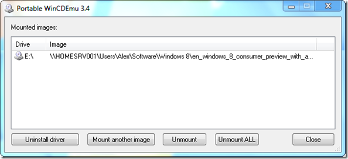

One of the first things I usually do when setting up a new system that I plan to use for longer is to install an ISO mount tool. My favorite FREE tool for that is still [Virtual CloneDrive](http://www.slysoft.com/en/virtual-clonedrive.html). Today I came across another utility that does the same thing, but is portable, meaning there is no need to really install the software, this might come in handy when you can’t or don’t feel like you want to leave behind a system with all of your tools installed. 

  The tool is called Portable WinCDEmu. I must admit however that the term “does not require installation” is not 100% correct, since when you launch the tool, it does prompt you with the following message. 

  

  Once the driver is installed and loaded you’re ready to mount an ISO file. 

  

  To permanently remove the driver simply click on the Uninstall driver option, the driver is then marked for deletion next time the system is rebooted. WinCDEmu can be downloaded from [here](http://wincdemu.sysprogs.org/portable/). 

  The good news, in [Windows 8 we won’t need any 3rd party utilities to mount an ISO file anymore](http://blogs.msdn.com/b/b8/archive/2011/08/30/accessing-data-in-iso-and-vhd-files.aspx), as this is build-in functionality.

