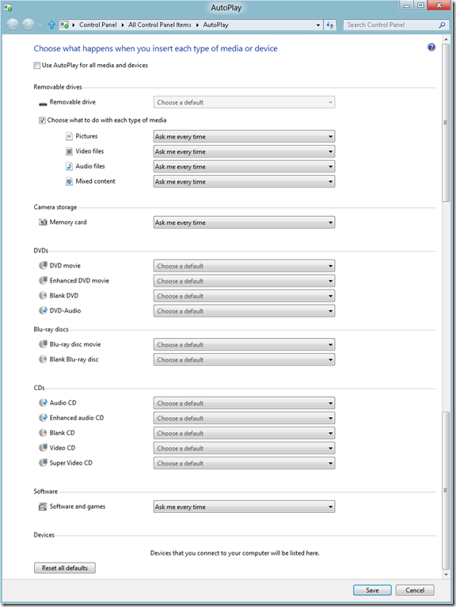

While continuing my journey through Windows 8 I noticed some changes in the AutoPlay configuration. Compared to Windows 7, the AutoPlay configuration in Windows 8 is now clearly categorized by device / media type. A separate configuration option is now available for Camera storage and an additional option was added for blank blue-ray discs.

  

  *(don’t be surprised about the two separate scrollbars in the above picture, I just pasted two screenshots together).*

