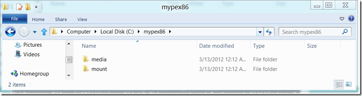
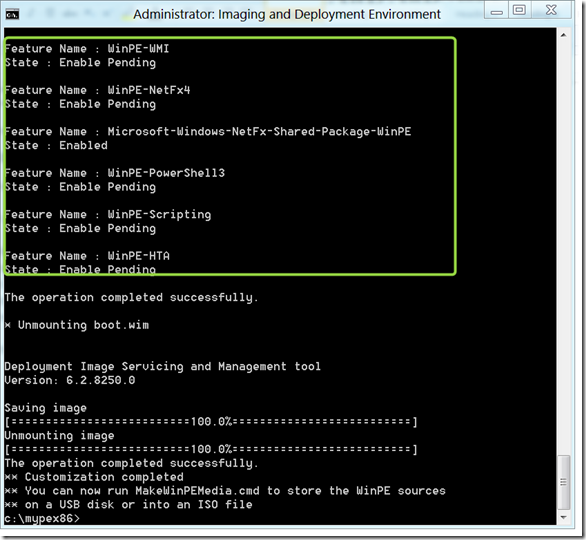
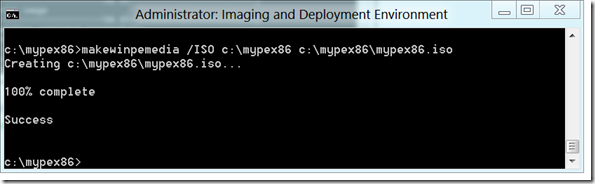
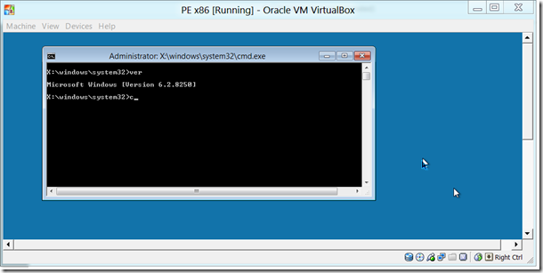

Today I want to share with you a small script I’ve put together for customizing WinPE 4.0 that will ship with Windows 8. I’ve rewritten the script based on some existing script code we already use today, but wanted by purpose a small independent script that I can hook in between the standard scripts provided within the ADK sources, mainly for familiarizing myself with anything new within WinPE 4.0.

  When you install the Windows Assessment and Deployment Kit (ADK) on a 64 bit system, you will find the WinPE 4.0 sources stored under C:\Program Files (x86)\Windows Kits\8.0\Assessment and Deployment Kit\Windows Preinstallation Environment. 

  Within that folder you will find 3 batch files. copype.cmd which is used to prepare the WinPE sources, MakeWinPEMedia.cmd that allows you to store the previously created WinPE sources to a USB stick or save them to a bootable ISO file and. then there is a file called setsanpolicy.cmd.that is used to [configure Storage Area Network (SAN) Policy in Windows PE](http://technet.microsoft.com/en-us/library/hh825063.aspx). 

  So let’s say you want to create an ISO file that contains the 32 bit version of WinPE 4.0 with the following [optional components](http://technet.microsoft.com/en-us/library/hh824926.aspx) added:

     
- Scripting     
- HTA     
- WMI     
- .NET 4.0     
- PowerShell  

  **Step 1**: If not done so already [download](http://www.microsoft.com/download/en/details.aspx?id=28997) and install the ADK on your client. 

  **Step 2:** Unless you want to launch the Deployment and Imaging Environment command prompt from the Metro Start Menu, create a shortcut on your Windows Desktop pointing to: C:\Windows\system32\cmd.exe /k "C:\Program Files (x86)\Windows Kits\8.0\Assessment and Deployment Kit\Deployment Tools\DandISetEnv.bat 

  **Step 3:** Launch an elevated Deployment and Imaging command prompt.

  **Step 4:** Run the following command: copype.cmd x86 c:\mypex86      
If all went fine you get an folder that looks like this     
      

  **Step 5:** Now run the following command: custpe.cmd mypex86 x86

  The script should be quite self explaining but basically does the following:

     
- Validate the command line input, if you just launch it without any options help is provided.     
- Mount the boot.wim located within the specified WinPE working directory     
- Add the defined optional components    
- Lists the installed packages and features (just to show you what’s in now)    
- Unmounts and commits the modified boot.wim 

  Note that this can take a little while. If it all worked out you should see the following output. 

  

  **Step 6:** Now let’s make this a bootable ISO file by running the following command:     
makewinpemedia.cmd /ISO C:\MyPEx86 C:\MyPEx86\MyPEx86.ISO

  

  **Step 7**: Boot your virtual machine from the ISO file. 

  

  Watch out for a follow post, I’ll do an update if I come across anything new in WinPE 4.0. For now that’s it.    
    
P.S: If you are using a x86 OS version, you must change the “Program Files (x86)” within the below script to just “Program Files”. 

  **CUSTPE.CMD**

  @echo off

  rem     
rem Input validation      
rem      
if /i "%1"=="/?" goto usage      
if /i "%1"=="" goto usage      
if /i "%~2"=="" goto usage

  if /i not "%2"=="x86" (     
  if /i not "%2"=="amd64" goto usage      
)

  if not exist "%1\media\sources\boot.wim" (     
    echo.      
    echo ERROR: The file "%1\media\sources\boot.wim" does not exist      
    echo        Verify the working directory. If you have no WinPE      
    echo        folder run copype.cmd first.       
    echo.      
    PAUSE      
    GOTO :END      
)

  set bitv=%2

     
:: ---------------------------------------------------------------------------------     
:: Mount Image      
:: ---------------------------------------------------------------------------------

  echo.     
echo * Mounting boot.wim      
echo.

  dism.exe /Mount-Image /ImageFile:"%1\media\sources\boot.wim" /index:1 /MountDir:"%1\Mount"     
if errorlevel 1 (      
    echo ** Error occurred mounting %1\media\sources\boot.wim      
    PAUSE      
    GOTO :END      
    )

  :: ---------------------------------------------------------------------------------     
:: Add Packages      
:: ---------------------------------------------------------------------------------      
:: Add WMI Support      
dism /image:"%1\Mount" /add-package /packagepath:"c:\program files (x86)\Windows Kits\8.0\Assessment and Deployment Kit\Windows Preinstallation Environment\%bitv%\WinPE_OCS\winpe-wmi.cab"      
dism /image:"%1\Mount" /add-package /packagepath:"c:\program files (x86)\Windows Kits\8.0\Assessment and Deployment Kit\Windows Preinstallation Environment\%bitv%\WinPE_OCS\en-us\WinPE-WMI_en-us.cab"

  :: Add Scripting Support     
dism /image:"%1\Mount" /add-package /packagepath:"c:\program files (x86)\Windows Kits\8.0\Assessment and Deployment Kit\Windows Preinstallation Environment\%bitv%\WinPE_OCS\WinPE-Scripting.cab"      
dism /image:"%1\Mount" /add-package /packagepath:"c:\program files (x86)\Windows Kits\8.0\Assessment and Deployment Kit\Windows Preinstallation Environment\%bitv%\WinPE_OCS\en-us\WinPE-Scripting_en-us.cab"

  :: Add HTA Support     
dism /image:"%1\Mount" /add-package /packagepath:"c:\program files (x86)\Windows Kits\8.0\Assessment and Deployment Kit\Windows Preinstallation Environment\%bitv%\WinPE_OCS\WinPE-HTA.cab"      
dism /image:"%1\Mount" /add-package /packagepath:"c:\program files (x86)\Windows Kits\8.0\Assessment and Deployment Kit\Windows Preinstallation Environment\%bitv%\WinPE_OCS\en-us\WinPE-HTA_en-us.cab"

  :: Add .NET 4.0 Support     
dism /image:"%1\Mount" /add-package /packagepath:"c:\program files (x86)\Windows Kits\8.0\Assessment and Deployment Kit\Windows Preinstallation Environment\%bitv%\WinPE_OCS\WinPE-NetFx4.cab"      
dism /image:"%1\Mount" /add-package /packagepath:"c:\program files (x86)\Windows Kits\8.0\Assessment and Deployment Kit\Windows Preinstallation Environment\%bitv%\WinPE_OCS\en-us\WinPE-NetFx4_en-us.cab"

  :: Add PowerShell Support     
dism /image:"%1\Mount" /add-package /packagepath:"c:\program files (x86)\Windows Kits\8.0\Assessment and Deployment Kit\Windows Preinstallation Environment\%bitv%\WinPE_OCS\WinPE-PowerShell3.cab"      
dism /image:"%1\Mount" /add-package /packagepath:"c:\program files (x86)\Windows Kits\8.0\Assessment and Deployment Kit\Windows Preinstallation Environment\%bitv%\WinPE_OCS\en-us\WinPE-PowerShell3_en-us.cab"

     
:: ---------------------------------------------------------------------------------     
:: Display installed Packages, Features      
:: ---------------------------------------------------------------------------------      
Echo Installed WinPE Packages and Features      
Dism /image:"%1\Mount" /get-packages      
Dism /image:"%1\Mount" /get-features

     
:: ---------------------------------------------------------------------------------     
:: Unmount and commit changes      
:: ---------------------------------------------------------------------------------      
echo.      
echo * Unmounting boot.wim      
echo.      
dism.exe /Unmount-Image /MountDir:"%1\Mount" /Commit      
if errorlevel 1 (      
    echo ** Error occurred unmounting %1\Mount      
    pause      
    GOTO :END      
    ) ELSE (      
    echo ** Customization completed      
    echo ** You can now run MakeWinPEMedia.cmd to store the WinPE sources      
    echo ** on a USB disk or into an ISO file      
    GOTO :END      
)

     
:usage     
echo Customize WinPE environment      
echo.      
echo custpe  ^<workingDirectory^> {/amd64 ^| /x86}      
echo.      
echo workingDirectory  The directory that holds the PE sources created with copype      
echo amd64        Used when target PE is 64 Bit      
echo x86        Used when target PE is 32 Bit       
echo.      
echo Example: custpe C:\WinPE_amd64      
pause      
goto :END

  :END

