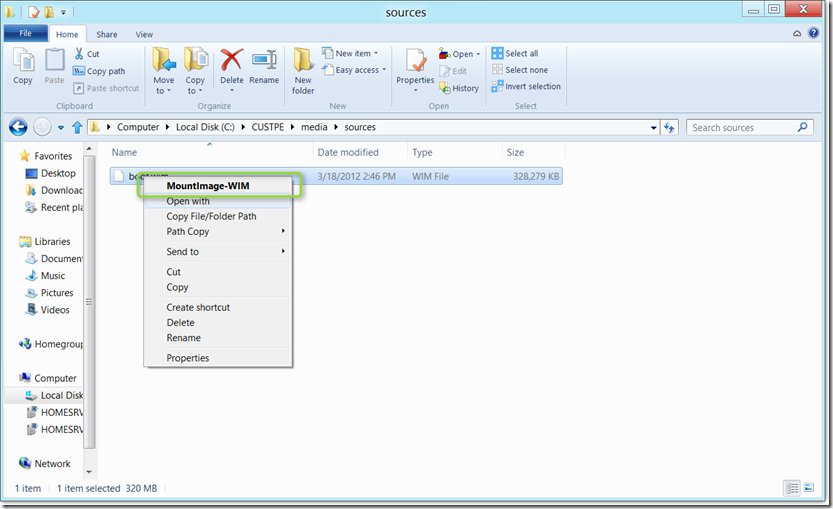
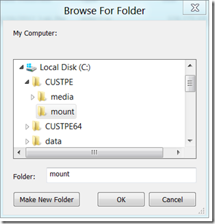
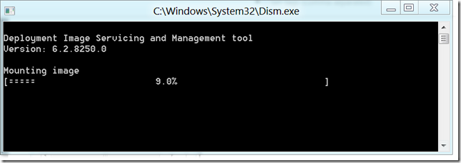
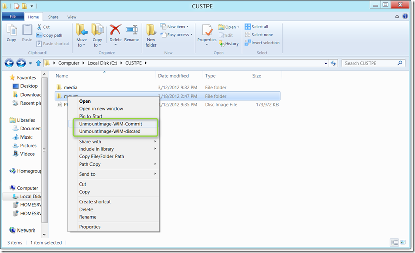

Mounting and un-mounting Windows Images (wim files) is a simple task using dism.exe or imagex.exe at the command prompt, but if you do this every day you might get annoyed by typing the same string of commands over and over again. A few years back my colleague Claude Henchoz shared a script to add some WIM management options to the Windows Explorer context menu. 

  I have now taken these scripts and updated them so that they use dism.exe exclusively and also added a 3rd party utility that runs the commands in elevated mode, so now we can also use the Explorer context menu options with UAC on. 

  **Here’s how it works     
**When you have completed the setup you will see the context menu option called “MountImage-WIM” when selecting a file with the extension .WIM. 

  

  You then select the folder in which you want to mount the file. 

  

  

  When you have completed whatever you needed to do with the mounted content, simply right click on the folder that holds the mounted image and select the appropriate option to dismount the image. 

  

  **How to install this on your system**

  **Step 1**: First download the FREE **Elevate** utility from [here](http://www.winability.com/elevate/). As you probably know, dism requires to be executed with elevated rights. Once downloaded copy elevate.exe or elevate64.exe into the c:\windows folder so Windows will always find it. 

  **Step 2**: Copy the below content into a file called **wimcontextmenuInstall.vbs** and copy the file to C:\Program Files\wimcontextmenu

  Set WshShell = CreateObject("WScript.Shell")     
xMount="wscript.exe ""C:\Program Files\wimcontextmenu\wimMount.vbs"" "      
WshShell.RegWrite "HKCR\.wim\Shell\MountImage-WIM\Command\", xMount & " ""%1""","REG_SZ"      
xCommit="wscript.exe ""C:\\Program Files\\wimcontextmenu\\wimUnmountCommit.vbs"" "      
WshShell.RegWrite "HKCR\Directory\Shell\UnmountImage-WIM-Commit\Command\", xCommit & " ""%1""","REG_SZ"      
xDismiss="wscript.exe ""C:\\Program Files\\wimcontextmenu\\wimUnmountDismiss.vbs"" "      
WshShell.RegWrite "HKCR\Directory\Shell\UnmountImage-WIM-discard\Command\", xDismiss & " ""%1""","REG_SZ"      
Set WshShell = Nothing

  Then open an elevated command prompt and run    
cscript wimcontextmenuInstall.vbs 

  **Step 3**: Create a file called **wimMount.vbs** and copy paste the below content then save it into the folder C:\Program Files\wimcontextmenu

  set sh=CreateObject("WScript.Shell")     
cmdLineArg=WScript.Arguments.Item(0)      
browsedFolder=FolderBrowse()      
constructedCmdLine="elevate64.exe -wait4exit dism.exe /mount-wim /wimfile:" & chr(34) & cmdLineArg & chr(34) & " /index:1 " & " /Mountdir:" & chr(34) & browsedFolder & chr(34)      
sh.Run constructedCmdLine,7,True

  msgbox "Mount complete"

  function FolderBrowse()     
 Const BIF_EDITBOX = &H10      
 Const BIF_NEWDIALOGSTYLE = &H40      
 Set sa = CreateObject("Shell.Application")      
 Set oF = sa.BrowseForFolder(0, "My Computer:", BIF_EDITBOX Or BIF_NEWDIALOGSTYLE, 17)      
 Set fi = oF.Items.Item      
 FolderBrowse = fi.Path      
end function    

  **Step 4**: Create a file called **wimUnmountDismiss.vbs** and copy paste the below content then save it into the folder C:\Program Files\wimcontextmenu

  set sh=CreateObject("WScript.Shell")     
cmdLineArg=WScript.Arguments.Item(0)      
constructedCmdLine="elevate64.exe -wait4exit dism.exe /Unmount-wim /MountDir:" & chr(34) & cmdLineArg & chr(34) & " /discard"       
sh.Run constructedCmdLine,7,True      
msgbox "Unmount complete"

  **Step 5**: Create a file called **wimUnmountCommit.vbs** and copy paste the below content then save it into the folder C:\Program Files\wimcontextmenu

  set sh=CreateObject("WScript.Shell")     
cmdLineArg=WScript.Arguments.Item(0)      
constructedCmdLine="elevate64.exe -wait4exit dism.exe /Unmount-wim /MountDir:" & chr(34) & cmdLineArg & chr(34) & " /commit"       
sh.Run constructedCmdLine,7,True      
msgbox "Unmount complete"

  You’re done now, enjoy mounting and un-mounting WIM files from the Windows Explorer context menu. 

  Some final notes:

     
- Ensure to adjust the scripts when using the 32 bit version of elevate.exe instead of elevate64.exe.     
- I have tried to get the dism.exe elevated by using the technique described [here](https://www.verboon.info/index.php/2011/03/running-an-application-as-administrator-or-in-compatibility-mode/), but was not successful, that’s why for now you’ll need the elevate.exe utility.     
- I’ve tested this on Windows 7 and Windows 8 Consumer Preview.

