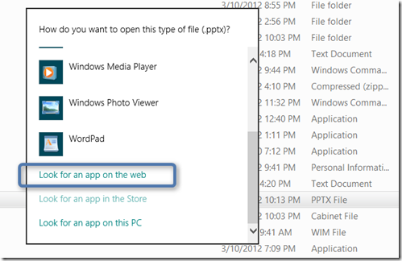
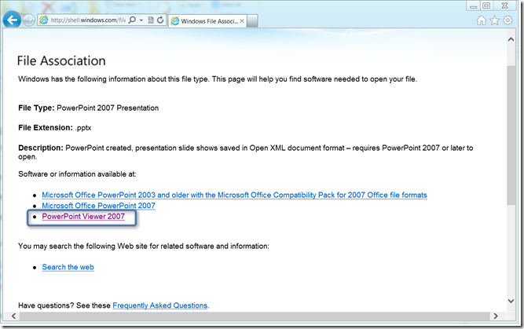
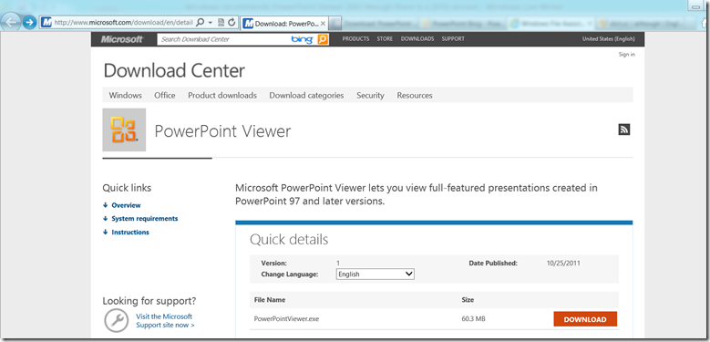

While working on my Windows 8 test client, I downloaded a PowerPoint file and because I don’t have Office installed Windows prompts me how I would like to open this file. Knowing that it will point me to the PowerPoint Viewer I choose to look for an app on the web. 

  

  But surprisingly the Windows File Association information site recommendation lists Microsoft Power Point 2007 and PowerPoint Viewer 2007. 

  

  So I start to wonder whether there might be a 2010 version as well and indeed there is one it’s just not called PowerPoint Viewer 2010 but just PowerPoint Viewer. 

  

  Microsoft PowerPoint Viewer (2010) can be downloaded from [here](http://blogs.office.com/b/microsoft-powerpoint/archive/2010/05/13/powerpoint-viewer-available-for-download.aspx) and for more details read the PowerPoint Blog .post [here](http://blogs.office.com/b/microsoft-powerpoint/archive/2010/05/13/powerpoint-viewer-available-for-download.aspx)

