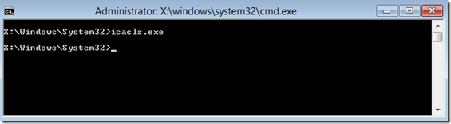
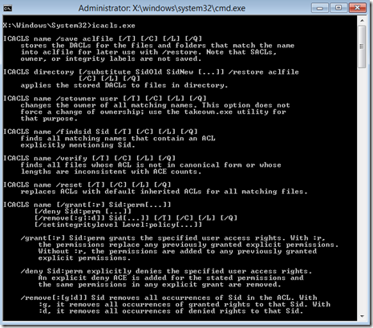

To keep the footprint of WinPE as small as possible many services or tools usually found within a full Windows installation are not available within WinPE. So if you need a command-line tool from Windows such as icacls.exe you just copy the executable into your WinPE sources and you’re done.

  But hey, when booting into WinPE and executing icacls.exe, nothing is displayed, the command itself however works.

  

  Unfortunately just copying the the executable alone isn’t enough since it is language neutral, you must also copy the corresponding localization file. These can be found under C;\Windows\System32\<locale> so for English C;\Windows\System32\en-US. For icacls.exe we would copy the file ICacls.exe.mui into the WinPE’s \Windows\System32\en-US folder.

  Now when executing icacls.exe, we do get feedback.

  

  More information for Multilanguage and Localization can be found here:

  [Resource Utilities](http://msdn.microsoft.com/en-us/library/windows/desktop/dd319113(v=vs.85).aspx)
[Understanding MUI](http://msdn.microsoft.com/en-us/goglobal/dd218459.aspx)
[NLS Knowledge Center](http://msdn.microsoft.com/en-us/goglobal/dd565826.aspx)

