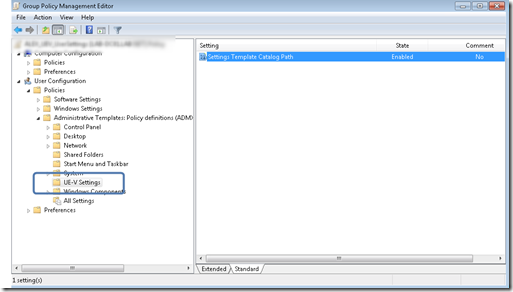
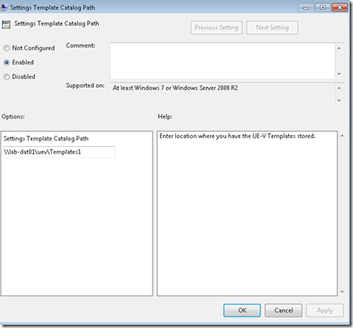

To simplify my testing activities with Microsoft’s User Experience Virtualization (UE-V( Beta, I created a Group Policy template that configures the User’s SettingsTemplateCatalogPath. The SettingsTemplateCatalogPath is the location where UE-V looks for new or updated templates once a day.

  The SettingsTemplateCatalogPath setting is stored within the  Windows Registry under
HKEY_CURRENT_USER\Software\Microsoft\UEV\Agent\Configuration

  To get the GPO working I had to create another “custom” registry value called GP_SettingsTemplateCatalogPath_Set which defines whether the setting is enabled or disabled. (Well possible that this workaround isn’t required, but I couldn’t find another way to get my home-brew policy working).

  The template can be copied from [here](https://www.verboon.info/fun/gp_uev_SettingsTemplateCatalogPath.zip) once downloaded copy the content into the local folder C:\Windows\PolicyDefinitions or into the central store.

  Note that UE-V is still in Beta, well possible that Microsoft will introduce official GPO settings for now feel free to use this (at your own risk).

  

  

