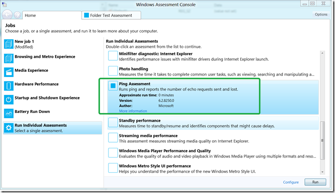
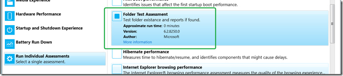
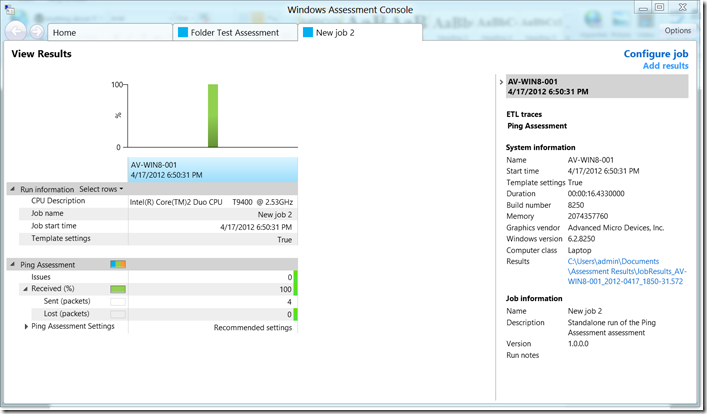

In the [Scaling And Extending Windows Assessments To Improve System Quality (Part I & II)](http://channel9.msdn.com/Events/BUILD/BUILD2011/HW-148P) presentation shown at the //BUILD conference in September Jason Cohen a Senior Software Development Engineer at Microsoft demonstrated how to create a custom Assessment job using a Ping test as example. 

  Excited about the idea of extending the Windows Assessment Console with self-defined tests, I have since spend quite some time reading the related documentation on [MSDN](http://msdn.microsoft.com/en-us/library/windows/desktop/hh437709(v=vs.85).aspx). I can imagine that one day I would be able to automate a large amount of system validation and certification tests that nowadays are performed manually or with individual scripts can be fully integrated into the Assessment Console that not only takes care of the automation but also provides a nice reporting interface. 

  When you have the ADK installed,. you find all of the pre-defined Assessments stored under the folder C:\Program Files (x86)\Windows Kits\8.0\Assessment and Deployment Kit\Windows Assessment Toolkit. 

     
- Content based Assessments    
- Energy    
- Memory Assessments    
- Windows Core Assessments 

  When opening one of these *.asmtx files you will notice that the files have an XML Syntax, a complete overview can be found in the AXE Schema Reference on [MSDN](http://msdn.microsoft.com/en-us/library/windows/desktop/hh449339(v=vs.85).aspx) However I guess at very first moment the average Tech guy (like me) will be overwhelmed by the vast number of Elements that can be used for the Assessment, Job and Result manifests. 

  I initially tried to reverse engineer some things, but had poor results and unfortunately there aren’t any examples posted on MSDN yet, so I decided to drop Jason an e-mail if he could pass on the Ping Test example he had used for demonstration purposes in his Demo. A few days later he  kindly responded and send me the Ping-Test files. I was then able to register it within the Assessment Console and it also provided me with a basis to create my first own assessment called Folder-Test which isn’t perfectly complete, but gives an idea of what can be done further. 

  Now let me guide you through the process of registering a custom Assessment job. 

     
- Download the samples I have stored [here](https://www.verboon.info/fun/CustomAssessment.zip)      
    
- Create a folder called **CustomAssessments** under C:\Program Files (x86)\Windows Kits\8.0\Assessment and Deployment Kit\Windows Assessment Toolkit\ and copy all the files provided in the samples ZIP file into this folder.       
    
- Then to register the Ping Test Assessment and the Folder Test Assessment run the following commands     
      
C:\Program Files (x86)\Windows Kits\8.0\Assessment and Deployment Kit\Windows Assessment Toolkit\x86\regasmt.exe “C:\Program Files (x86)\Windows Kits\8.0\Assessment and Deployment Kit\Windows Assessment Toolkit\CustomAssessments\pingtest.asmtx”      
      
C:\Program Files (x86)\Windows Kits\8.0\Assessment and Deployment Kit\Windows Assessment Toolkit\x86\regasmt.exe “C:\Program Files (x86)\Windows Kits\8.0\Assessment and Deployment Kit\Windows Assessment Toolkit\CustomAssessments\foldertest.asmtx”      
      
What regasmt.exe does is creating a new entry under:      
HKEY_LOCAL_MACHINE\SOFTWARE\Wow6432Node\Microsoft\Assessments\Installed      
    
- When now opening the Assessment Console you will find the new custom PING Assessment Jobs listed under the “Run Individual Assessment” Node.      
      
      
The same for the Folder Test      
      
      
      
Note that when running regasmt it validates the manifest file and if there are errors the registration fails, also if later you edit/update the manifest file, even if it is registered already, when there are syntax issues, the assessment will not be shown in the Assessment console.       
    
- Now that the Assessments are registered we can execute them directly from the assessment console or package them to be executed on another system.      
      
 

  I hope I could spread some inspiration on what can be done with the Assessment Console. Many thanks to Jason for sharing his example with me.

