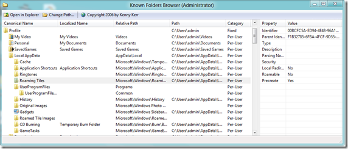

Are you finding all the “special folders” in Windows Vista/7/8 a bit overwhelming? Which are real folders and which are virtualized? Which are profile-specific and which are common to all users? Which are rooted and which are relative? The Known Folders Browser can help. 

  

  The Known Folders Browser written by Kenny Kerr can be downloaded from [here](http://weblogs.asp.net/kennykerr/archive/2006/11/02/Known-Folders-Browser-1.0-_2800_for-Vista-and-Beyond_2900_.aspx)

