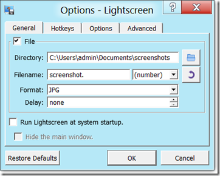

Here’s yet another FREE screen capture utility I’ve come across. LightScreen allows you to capture the entire screen, just a Window or an area of the screen. 

  

  LightScreen can be downloaded from [here](http://lightscreen.sourceforge.net/index)

