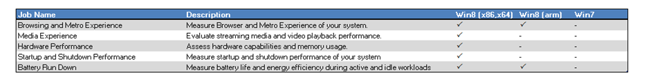
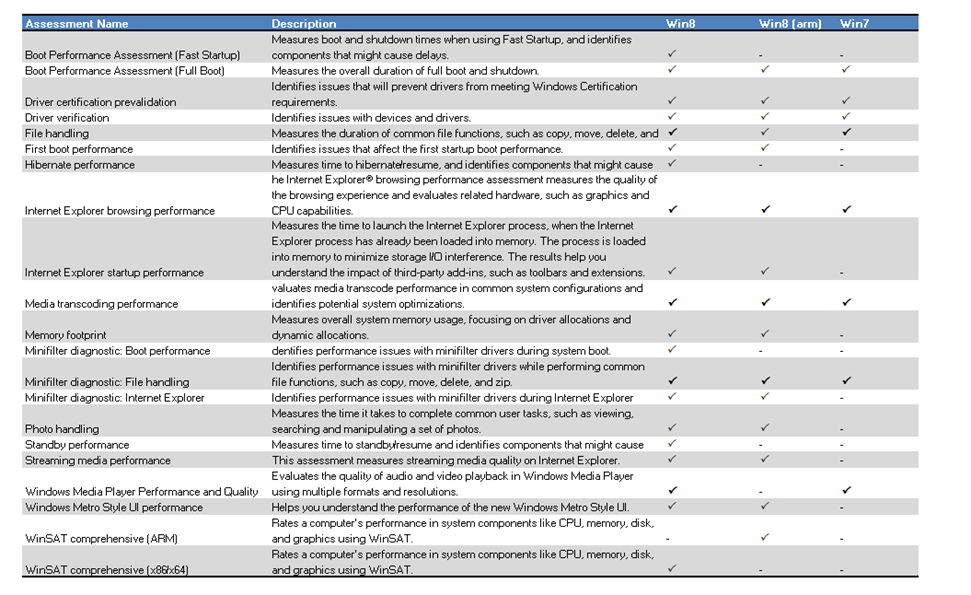

Along with Windows 8 Microsoft also provides a new tool for System Builders and IT Professionals called the Windows Assessment Toolkit. The Windows Assessment Toolkit allows to determine the quality of a running operating system or a set of components with regard to performance, reliability, and functionality. 

  Now since I’m sure Windows 7 will be around for a while, I wondered whether some of these Assessments would also run Windows 7 so I started reviewing each Job and Individual Assessment listed within the Assessment Console. My findings are listed below.I have also indicated whether the Assessment is designed to run on the x86,x64 and/or ARM architecture. 

  **Windows Assessment Jobs**

  These are the predefined Jobs within the Assessment Console that consist of various assessments. 

  

  **Individual Assessments**

  These are all the individual assessments currently available within the Assessment Console. 

  

  For those interested in the detail. When opening an Assessment manifest file like C:\Program Files (x86)\Windows Kits\8.0\Assessment and Deployment Kit\Windows Assessment Toolkit\Windows Core Assessments\WinSAT.Formal.x86x64.asmtx you will find in most cases an element called [VerifyOSVersion](http://msdn.microsoft.com/en-us/library/windows/desktop/hh437703(v=vs.85).aspx). which defines the minimum Operating System version required. 

  However I did find the below listed Assessments that do not have this element included, hence I assume they will run fine on both Windows 7 and Windows 8 and have therefore flagged them in the above list as such. 

  Browser.asmtx   
EnergyEfficiency.asmtx    
FileOrg.asmtx    
FileOrg-EnergyWorkload.asmtx    
FileOrg-Minifilter.asmtx    
Idle-EnergyWorkload.asmtx    
Media_Transcode.asmtx    
Media_WMP_Playback.asmtx    
Media_WMP_Playback-EnergyWorkload.asmtx

  Note that Windows 8 and the ADK are still in BETA so things might change.

