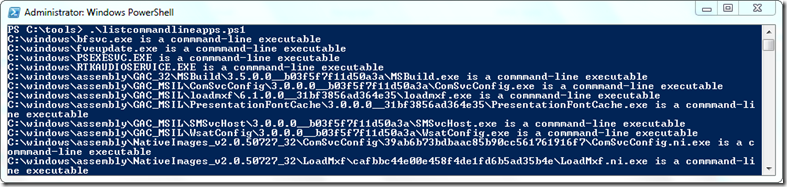

I recently came across a FREE utility called [IsCommandLineApp](http://helgeklein.com/free-tools/iscommandlineapp/) from [Helge Klein](http://helgeklein.com/),  a little command-line tool that can be used to determine whether a specific executable is a command-line program. To run this against multiple executables manually is a kind of a pain, so I decided to write a PowerShell script that runs IsCommandLineapp against a defined Folder and all it’s subfolders. 

  [

](https://www.verboon.info/wp-content/uploads/2012/05/image.png)

  To run the script, first download the IsCommandLineApp from [here](http://helgeklein.com/free-tools/iscommandlineapp/")) and then edit the variable **$IsCommandLineApp** so that it points to the location where you have stored the tool. If you want to search through another folder than C:\Windows change the variable **$StartPath** 

   

  
```

# =====================================================================
  
# Script Name : listcommandlineapps.ps1

  
# Author: Alex Verboon

  
# Date: May 2012

  
# Purpose: List all executables that are a commandline application

  
# =====================================================================

  
$ErrorActionPreference = "SilentlyContinue"

  
$IsCommandLineApp = "c:\Tools\IsCommandLineApp.exe"

  
$StartPath = "c:\windows\"

  
if (Test-Path $IsCommandLineApp)

  
 {

  
# IscommandlineApp.exe found

  
 }

  
else

  
 {

  
 echo($IsCommandLineApp + " not found. Download from [http://helgeklein.com/free-tools/iscommandlineapp/")](http://helgeklein.com/free-tools/iscommandlineapp/"))

  
 exit

  
 }

 

$stringA = "is not a"

$files = get-childitem $StartPath -filter *.exe -recurse
  
 foreach ($file in $files)

  
 {

  
    $a = & $IsCommandLineApp $file.FullName

  
     if ( ($a.Contains($stringA)))

  
         {

  
         }

  
    Else

  
          {

  
        Write-output $a 

  
         }

  
 }

```

To get all the results into a text file run listcommandlineapps.ps1 >allcmdapps.txt

