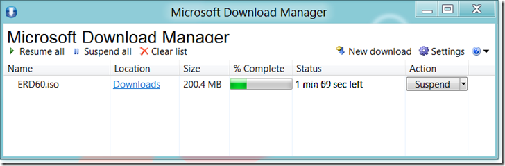

If you’re looking for a simple to use Download Manager, have a look at the Microsoft Download Manager. It does not have that many specialized features as many other download managers out there, but it’s a nice FREE and simple to use tool. You must install the software, but it only uses about 1.3 MB. 

  

  The Microsoft Download Manager can be downloaded from [here](http://www.microsoft.com/en-us/download/details.aspx?id=27960)

