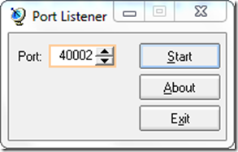
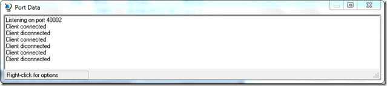
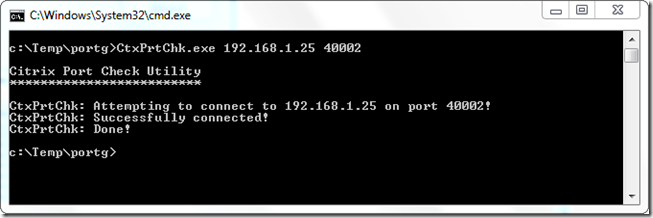

Today I want to share with you a nice FREE tool I’ve just used recently while troubleshooting some networking issues on one of our customers network. The problem I had was that I couldn’t get my backend infrastructure talk to the client and vise versa. To keep this post generic I won’t use any products name, but both the backend and client that has an agent require that some ports are open in either one or both ways. 

  I ended up talking to some network guys who had to open ports individually since in this environment by default all ports are closed except those specifically defined. After some time I realized that doing the tests via software product itself was too time consuming as sometimes it needed a while to process the request and get a result. I could of course also use the Windows build in netstat.exe command but well, I just wanted something that just tells me instantly whether the port works or not without having to scroll down a huge list of data. 

  So I ended up finding a nice FREE small utility called Port Listener. Port Listener allows you to configure a port and then listen to it. On the other end then you can use a utility like the [Citrix Port Check Utility](https://www.verboon.info/index.php/2011/05/tooltip-citrix-port-check-ctxprtchk-exe/) to verify that the port is working e.g can cross the network and any firewalls in between both end points. 

  Port Listener is easy to setup, simply launch the utility and enter the port to listen to, then press Start to start listening. 

  

  

  Then on the other end start the Citrix Port check utility. 

  

  Port Listener is developed by [RJL Software](http://www.rjlsoftware.com/) can be downloaded from [here](http://www.rjlsoftware.com/software/utility/portlistener/)

