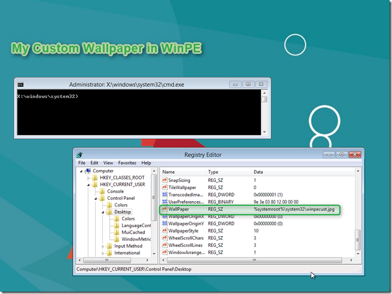

As a follow up on my earlier post [Windows 8 – Script for customizing WinPE 4.0 – Part 1](https://www.verboon.info/index.php/2012/03/windows-8-script-for-customizing-winpe-4-0-part-1/) I want to share with you how to customize the WinPE wallpaper. Credits go to blog reader “Max” who responded on a question from reader Carl H. 

  In WinPE 4.0 the wallpaper is not called winpe.bmp as in previous versions of WinPE but winpe.jpg. Also the winpe.jpg has special permissions so overwriting the file would require changing them. An easier approach is to add your custom WinPE wallpaper file to the WinPE sources and change the appropriate registry value in WinPE.

  In the below example the WinPE sources are mounted into the local folder C:\mype64\mount and we have copied our custom wallpaper called winpecust.jpg into the \system32\ folder of WinPE.

  We then run the below 3 command lines to mount the default user registry hive, edit the wallpaper registry value and then unmount the hive. 

  REG LOAD "HKLM\Winpe" "c:\mypex64\mount\Windows\system32\config\default"   
REG ADD "HKLM\winpe\Control Panel\Desktop" /v "Wallpaper" /d "%%systemroot%%\system32\winpecust.jpg" /t "REG_SZ" /F    
REG UNLOAD "HKLM\Winpe"

  And as you can see from the below screen shot, WinPE has now a custom wallpaper set. 

  

