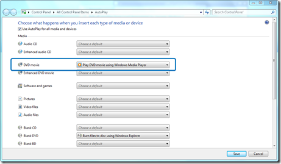
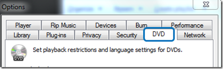
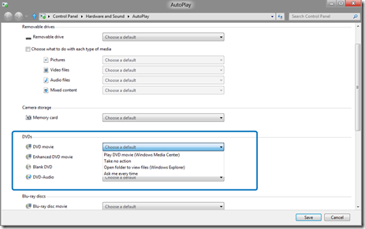

Microsoft recently confirmed that Windows Media Center will not be included by default within Windows 8 but will be available as an economical “media pack” add-on to Windows 8 Pro. One of the reasons for not including it anymore as a build-in feature is because according to the data Microsoft has collected via it’s [Customer Experience Improvement Program](https://www.verboon.info/index.php/2011/04/the-microsoft-customer-experience-improvement-programpart-1/) (CEIP) only a small percentage of users are actively using Media Center on Windows 7. Another reason is that nowadays more users are streaming video content over the internet instead of playing a local DVD. And finally, I guess that in just a few years the same will happen with DVD players as happened with the floppy drives, they will disappear. 

  For those interested Steven Sinofsky shared detailed telemetry data in the blog post [Reflecting on our first conversations (part 2)](http://blogs.msdn.com/b/b8/archive/2011/09/02/reflecting-on-our-first-conversations-part-2.aspx) from in September 2011. 

  In Windows 7 Windows Media Player is the default media player and will in most cases allow playback of DVDs. 

  

  and within Windows Media Player we have options for DVD playback.

  

     In Windows 8, Windows Media player is not listed anymore for DVD playback 

  

  and the DVD playback tab in Media Player options has disappeared. 

  

  Bottom line, when inserting a movie DVD into a system running Windows 8, you won’t be able to play the movie unless you are using Media Center (that is still included in the Windows 8 Consumer Preview) or a 3rd party DVD playback software. 

  I don’t expect this is going to have a big impact for consumer users, as most OEM hardware vendors like HP, Dell & Co ship their hardware with pre-installed OEM software for DVD playback like WinDVD, Roxio, Cyberlink PowerDVD. For Enterprise customers however this will have an impact. I have seen many customers who moved to Windows Vista/7 stop using third party DVD playback software because the build-in support provided by Windows Media player covered most users needs. 

  With Windows 8 not providing native DVD playback capabilities anymore Enterprises will need to make up their mind whether they need to provide DVD playback support to their end users and what products they will use. The most obvious solution appears to install the software that comes bundled with the hardware. But there are some challenges here. 

  The license of OEM software usually allows customers to use that program for as long as they want, but such software may *only* be used on the hardware that it was distributed with (e.g. you may use OEM-product X on computer model A, but you may not use it on computer model B, because that computer comes bundled with OEM-product B). This means that an enterprise with a standard desktop and a standard laptop will likely have to use two different OEM-products to achieve the same task. Every subsequent year, when the standard desktops and laptops are replaced by their successors, another set of OEM-products are introduced. With an estimated computer lifetime of 4 years, the enterprise has 8 different products in the environment to manage. In the best case, these OEM-products differ only slightly (different version numbers), but in the worst case, they may be entirely different products, even from different vendors.

  Another challenge is the right for distribution, in many cases the OEM software license does not allow re-packaging and/or distributing these OEM products via software distribution like System Center Configuration Manager. And finally size does matter as well, in many cases the OEM bundled DVD Playback software contains a huge installation source ranging from 300 up to 900 MB in size. Pre-installing several bundles within an image or installing them via software distribution will have an impact on image size and/or software distribution workload. 

  Enterprises that consider providing their end users with a 3rd party DVD Playback software on Windows 8 should consider the following two options: 

  **Volume Licensed Product**

  A volume licensed product is clearly the best (as in enterprise-ready) choice here. The advantages are numerous:

     
- One product running on *all* the different hardware models (reduces user-frustration and support call-handling complexity)    
- No advertisements for a “professional edition” of the product    
- Direct support from the product vendor    
- Product can often be packaged to the customer’s liking 

  Obviously, there is one argument against this choice: License costs. However this can be mitigated by providing the software optionally rather installing it on each system by default. 

  **Open-Source/Free Product**

  An open-source or free product that serves the purpose may also be a choice, depending on the importance of the availability of support channels. These products often perform the basic tasks that a typical user needs, but lack the advanced features that the professional products offer. Also, these products are delivered as-is and without any sort of warranty or declaration of fitness for a particular purpose. This may be a risk that customers may or may not want to deal with, however, certain advantages are still applicable:

     
- One product running on *all* the different hardware models (reduces user-frustration and support call-handling complexity)    
- No advertisements for a “professional edition” of the product 

  A well known open source product is the [VLC Media Player](http://www.videolan.org/vlc/index.html).

