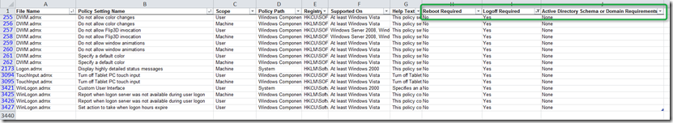

The Group Policy Settings Reference for Windows 8 and Windows Server 2012 now includes 3 additional columns providing additional information about each policy setting's behavior related to reboots, logoffs, and schema extensions.

     
- **Reboot Required**: A "Yes" in this column means Windows requires a restart before it applies the described policy setting.     
- **Logoff Required**: A "Yes" in this column means Windows requires the user to log off and log on again before it applies the described policy setting.     
- **Active Directory Schema or Domain Requirements**: A "Yes" in this column means you extend your Active Directory Schema before deploying this policy setting.  

  

  The spreadsheet can be downloaded from [here](http://www.microsoft.com/en-us/download/details.aspx?id=25250)

