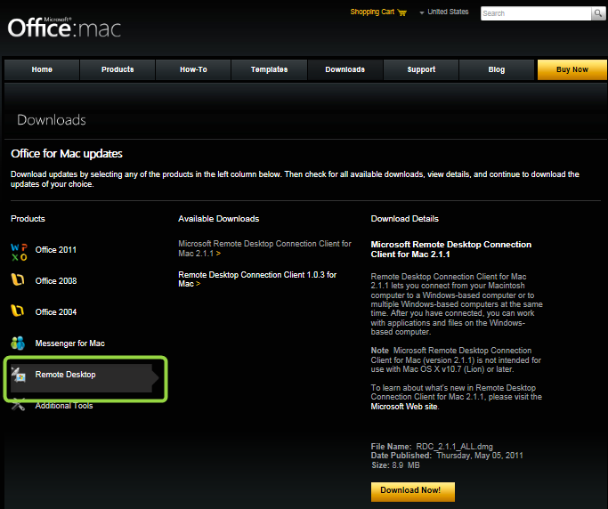
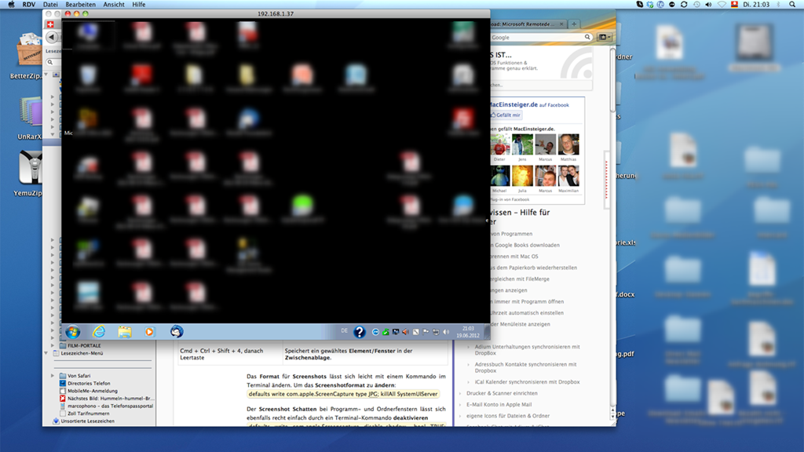

A friend of mine, an ultimate Mac user had recently bought a Windows PC to run an application not available on Mac. He asked me how he could remotely connect from his Mac to a Windows PC. I have little experience with Mac computers, but being interested in anything about IT, I remembered having seen something about a Remote Desktop client on the [Office for Mac website](http://www.microsoft.com/mac/downloads?pid=Mactopia_RDC&fid=68346E0D-44D3-4065-99BB-B664B27EE1F0#viewer).

  

  Once installed you can easily connect to a remote Windows client.

  

