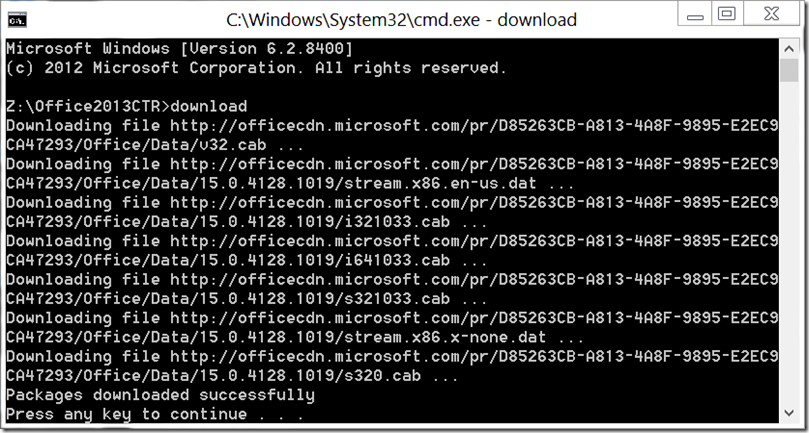
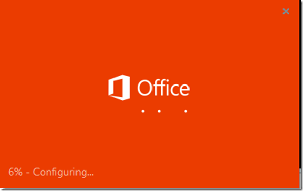
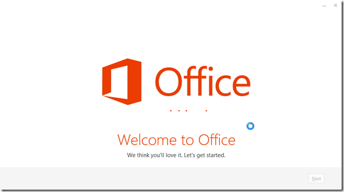
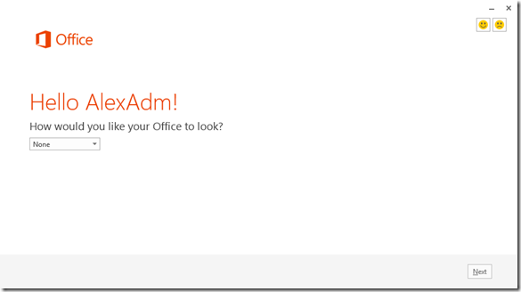
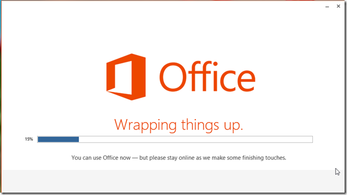
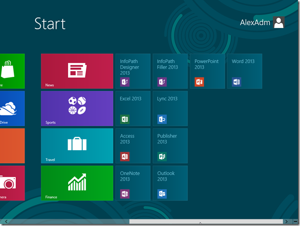
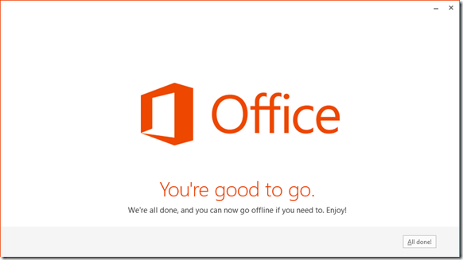
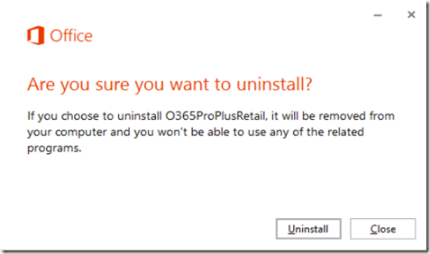
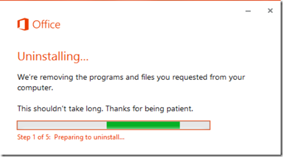
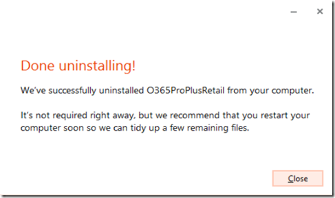

With the release of the Office 2013 preview Microsoft also made available the Office Deployment Tool for Click-to-Run deployments. Although we here a lot about Click-to-Run these days, it’s not something totally new. Microsoft first introduced this with Office 2010 but it didn’t get that much attention within enterprise environment. For Office 2013 I can imagine that this will change.

  Microsoft describes Click-to-Run as following:

  *Office 2013 Preview Click-to-Run is a technology that reduces the time that is required to download and use Office 2013 Preview client products. Click-to-Run is based on core virtualization and streaming Microsoft Application Virtualization (App-V) technologies. The streaming technology lets you use a Click-to-Run program before the complete program is downloaded and installed on your computer.*

  More details about the click-to-Run can also be found [here](http://technet.microsoft.com/en-us/library/jj219427(v=office.15).aspx). But let’s move on now and let me show you how easy it is to get this up and running.

  First download the Office Deployment Tool for Click-to-Run Preview from [here](http://www.microsoft.com/en-us/download/details.aspx?id=30344) store both files the setup.exe and the configuration.xml on a server share you have prepared upfront.

  Then modify the configuration.xml file so it has the following content:

  <Configuration>

  <Add SourcePath="\\srv010\data\Office2013CTR" OfficeClientEdition="32" >
    <Product ID="O365ProPlusRetail">
      <Language ID="en-us" />
    </Product>
  </Add>

    <!--  <Updates Enabled="TRUE" UpdatePath="\\Server\Share\Office\" /> -->

  <Display Level="Full" AcceptEULA="TRUE" />

     <Logging Name="OfficeSetup.txt" Path="%temp%" />

    <!--  <Property Name="AUTOACTIVATE" Value="1" />  -->

  </Configuration>

  Next run the following command from an elevated prompt:

  setup.exe /DOWNLOAD [\\configuration.xml">\\configuration.xml">\\<Server>\<Share>\configuration.xml](file://\\<Server>\<Share>\configuration.xml)

  

  Now logon to a Windows 8 or Windows 7 client and run the following command from an elevated prompt

  setup.exe /CONFIGURE [\\configuration.xml">\\configuration.xml">\\<Server>\<Share>\configuration.xml](file://\\<Server>\<Share>\configuration.xml)

  

  

  

  

  

  And there we got Office 2013. You can now launch an application, while in the background additional bits are downloaded and installed. At some point all is done and Office 2013 is fully installed.

  

  To remove Office 2013, make a copy of your configuration.xml file and change the word “Add” to “Remove” as shown in the example below.

  <Configuration>

  <Remove SourcePath="\\srv010\data\Office2013CTR" OfficeClientEdition="32" >
    <Product ID="O365ProPlusRetail">
      <Language ID="en-us" />
    </Product>
  </Remove>

    <!--  <Updates Enabled="TRUE" UpdatePath="\\Server\Share\Office\" /> -->

  <Display Level="Full" AcceptEULA="TRUE" />

     <Logging Name="OfficeSetup.txt" Path="%temp%" />

    <!--  <Property Name="AUTOACTIVATE" Value="1" />  -->

  </Configuration>

  And then run setup.exe /CONFIGURE [\\configuration.xml">\\configuration.xml">\\<Server>\<Share>\configuration.xml](file://\\<Server>\<Share>\configuration.xml) from an elevated prompt. .

  

  

  

  Additional Resources:
[Using Click-to-Run to install the new Office](http://blogs.technet.com/b/office_resource_kit/archive/2012/07/27/using-click-to-run-to-install-the-new-office.aspx)
[Customization overview for Click-to-Run](http://go.microsoft.com/fwlink/?LinkId=253344)
[Office Deployment Tool for Click-to-Run](http://go.microsoft.com/fwlink/?LinkId=253345)
[Click-to-Run for Office 365 Configuration.xml file](http://go.microsoft.com/fwlink/?LinkId=253346)
[Download Click to Run for Office 365 products by using the Office Deployment Tool](http://go.microsoft.com/fwlink/?LinkId=253347)
[Deploy Click-to-Run for Office 365 products by using the Office Deployment Tool](http://go.microsoft.com/fwlink/?LinkId=257844)

  [An overview of Microsoft Office Click-to-Run for Office 2010](http://support.microsoft.com/kb/982434)
[Click-to-Run: Delivering Office in the 21st Century](http://blogs.technet.com/b/office2010/archive/2009/11/06/click-to-run-delivering-office-in-the-21st-century.aspx)

