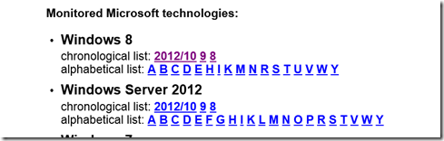

A great resource I am using for years already to proactively read through the Microsoft KB’s is [kbupdate.info](http://kbupdate.info/) a monitoring system that scans the entire Microsoft Knowledge Base every night. Now that Windows 8 and Server 2012 are out and Microsoft starts publishing KBs for it, you can track them easily via kbupdate.info

  

  Below just some random KB’s I found interesting to know about. 

  [Remote Group Policy updates are visible to users](http://support.microsoft.com/kb/2741537)     
[ADM files are not present in SYSVOL in the GPMC Infrastructure Status option](http://support.microsoft.com/kb/2741591)     
[Unpredictable behavior if you migrate a roaming user profile from Windows 8 to Windows 7](http://support.microsoft.com/kb/2748329)     
[You can only log on as "Other user" when the "Do not display last user name" Group Policy setting is enabled in Windows 8 or Windows Server 2012](http://support.microsoft.com/kb/2741622)     
[Group Policy preparation is not performed when you automatically prepare an existing domain for Windows Server 2012](http://support.microsoft.com/kb/2737129)

