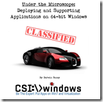

While only a few years ago the 64-bit version of the Windows client would only be installed on special purpose systems, nowadays it has become the de facto standard for most OEM’s and Enterprises. In 2010 Microsoft [published](http://windowsteamblog.com/windows/b/bloggingwindows/archive/2010/07/08/64-bit-momentum-surges-with-windows-7.aspx) some numbers on their Windows blog indicating that in June 46% of the clients running Windows 7 and use Windows Update were running Windows 7 64-Bit. At the same time Gartner published a report saying that by 2014 75% of all business PCs will be running a 64-Bit edition of Windows. Despite doing some searches on the web, I wasn’t able to get some actual figures, but if I just take into account the various customers I have worked with in the past 3 years supporting them moving to Windows 7, I can say that nearly all of them made their decision in favor of the 64-Bit edition of Windows.

  Those of you already working with Windows 7 64-Bit for sure have experienced that moment of “*What the heck is going on here, that script has ran for years…..*” and then minutes , hours or sometimes days later you realize that sometimes things just behave slightly different on a 64-Bit system. The bitness of the Operating System you’re running basically affects anything such as Drivers, Scripts and Applications.

  Whether you’re a long time Windows IT Pro veteran or just a junior desktop administrator I want to recommend an eBook I recently purchased called “Under the Microscope: Deploying and Supporting Applications on 64-Bit Windows”. I read a lot of eBooks but wouldn’t drop a blog post of each one I read, but honestly for this eBook I think it’s worth spreading the word. Actually while you might read through it once, I rather consider it as a handy reference that I will most definitely re-use in the future.

  The eBook is written by Darwin Sanoy who’s been writing articles and sharing his knowledge on DesktopEngineer.com since 1998 and nowadays runs [CSI:>Windows](http://csi-windows.com/) (**C**oncise **S**ystems **I**nternals). The eBook provides excellent in depth information every Windows Engineer, Administrator and especially Application Packaging Engineer or Application Provisioning specialist should know about managing their scripts and applications on Windows 64-Bit. In addition to the eBook itself you’ll also get a whole bunch of handy scripts and utilities useful for your daily 64-Bit challenges.

  

  You can order the eBook directly from the CSI Windows [website](http://csi-windows.com/ebooks/windows-64-bit#cover) and just in case you’re unsure whether it’s worth money, read the preview [here](http://csi-windows.com/ebooks/windows-64-bit#preview)

