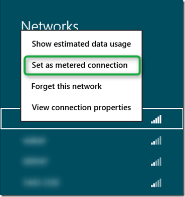
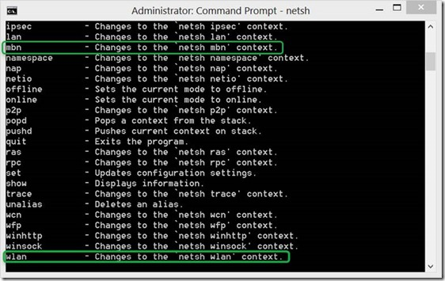
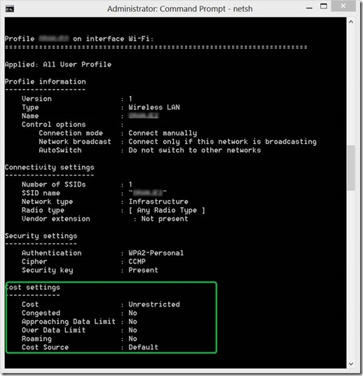
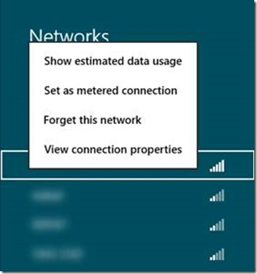
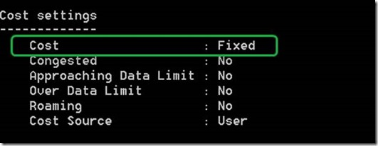
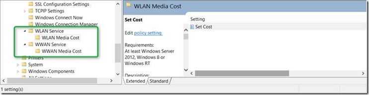
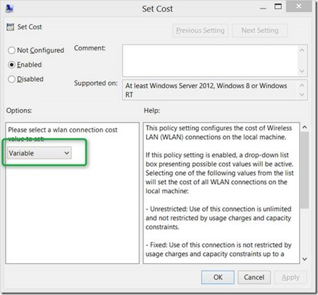
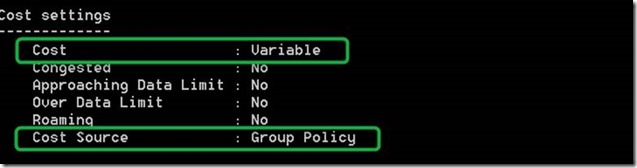
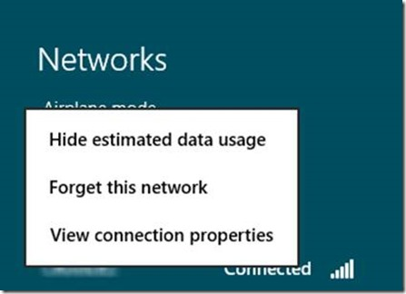
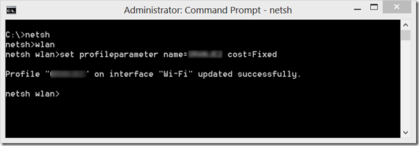

One of the new features in Windows 8 is that we can configure WLAN and WWAN cost settings. In the Windows UI this is called a metered connection.

  

  Why are these settings important? Well, when a Network is configured to be a Metered Connection, Windows will make several changes to the way that it uses the network to reduce overall network traffic through that connection, including the following:

- ·Only Critical Windows Updates are downloaded.
- ·Tile updates are limited to 50 MB per month.

  Computers with a 3G connection that use the native Mobile Broadband support in Windows 8 are automatically configured to be Metered Networks. In addition to Windows itself, well developed Windows 8 M-Style applications are supposed to behave as shown in the table below.

                                **Behavior**

                              **Guideline**

                                            Normal

                              If the [**NetworkCostType**](http://msdn.microsoft.com/en-us/library/windows/apps/windows.networking.connectivity.networkcosttype.aspx) is **Unrestricted** or **Unknown** and the [**ConnectionCost**](http://msdn.microsoft.com/en-us/library/windows/apps/windows.networking.connectivity.connectioncost.aspx) is not **Roaming**, then your app should implement **Normal** behavior.

            In **Normal** scenarios, your app should not implement restrictions. The connection should be treated as **Unlimited** in cost, and **Unrestricted** by usage charges and capacity constraints.

            Examples:

- Play an entire HD movie.
- Download a large file without restrictions or UI prompts.

                                            Conservative

                              If the [**NetworkCostType**](http://msdn.microsoft.com/en-us/library/windows/apps/windows.networking.connectivity.networkcosttype.aspx) is **Fixed** or Variable, and the [**ConnectionCost**](http://msdn.microsoft.com/en-us/library/windows/apps/windows.networking.connectivity.connectioncost.aspx) is not **Roaming** or **OverDataLimit**, then the app should implement **Conservative** behavior.

            In conservative scenarios, the app should implement restrictions for optimizing network usage to handle transfers over metered networks.

            Examples:

- Play movies in lower resolutions.
- Delay non-critical downloads.
- Avoid pre-fetching of information over a network.
- Switch to a header-only mode when receiving email messages.

                                            Opt-In

                              If the [**ConnectionCost**](http://msdn.microsoft.com/en-us/library/windows/apps/windows.networking.connectivity.connectioncost.aspx) is **Roaming** or **OverDataLimit**, your app should implement **Opt-In** behavior.

            For opt-in scenarios, your app should handle cases where the network access cost is significantly higher than the plan cost. For example, when a user is roaming, a mobile carrier may charge a higher rate data usage.

            Examples:

- Prompt the user before accessing the network.
- Suspend all background data network activities.

  Table Source: [http://msdn.microsoft.com/en-us/library/windows/apps/hh750310.aspx](http://msdn.microsoft.com/en-us/library/windows/apps/hh750310.aspx)

  To configure these cost settings we have several options:

- ·Manually through the Windows UI
- ·Using Group Policy
- ·Using the netsh command

  I am going to start with the netsh command because you cannot only use it to configure cost settings but also check the current state of settings that were set via the Windows UI or Group Policy.

  When we start an elevated command prompt and launching **netsh** and then type **help** we see the list of possible commands at this level.

  

  The 2 commands of interest here are **mbn** which changes into the mobile broadband network context and **wlan** which changes into the Wireless Lan context.

  So if now we type **netsh wlan show all** we also get information about the current cost settings.

  

  If nothing is configured, the Cost is set to **Unrestricted** and the Cost Source is **Default**.

  Home users or enterprise users where their administrator have not applied settings via Group Policy can configure cost settings via the Windows UI by selecting “Set as metered application”.

  

  If now we run netsh wlan show all again, we see how the **Cost** setting changed from **Unrestricted** to Fixed and that the **Cost Source** is set as **User**.

  

  Now let’s have a look at the Group Policy settings. Within the Group Policy Management Console under Computer Configuration \ Administrative Templates \ Network we find two nodes. **WLAN Service** and **WWAN Service.**

  

  

  When enabling the setting we have 3 options:

- ·Unrestricted: Use of this connection is unlimited and not restricted by usage charges and capacity constraints.
- ·Fixed: Use of this connection is not restricted by usage charges and capacity constraints up to a certain data limit.
- ·Variable: This connection is costed on a per byte basis.

  So if we enable the Setting to **Variable** we get the following result when executing **netsh wlan show all**

  

  Note that when cost settings are configured via Group Policy, the user cannot change the cost settings themselves.

  

  And finally if for some reason you cannot use the Group Policy based method, but want to automate the WLAN/WWAN cost setting configuration, you can use the following netsh command

  Netsh wlan set profileparameter name=<profilename> cost=cost=default|unrestricted|fixed|variable

  

  Recommended reading:

  [Engineering Windows 8 for mobile networks](http://blogs.msdn.com/b/b8/archive/2012/01/20/engineering-windows-8-for-mobility.aspx)

  [Quickstart: Managing connections on metered networks (Windows Store apps using JavaScript and HTML)](http://msdn.microsoft.com/en-us/library/windows/apps/hh750310.aspx)

