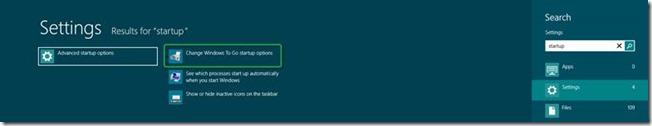
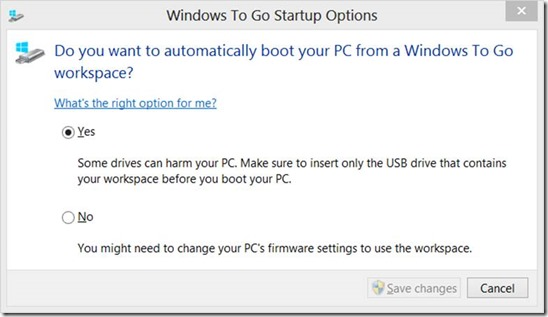
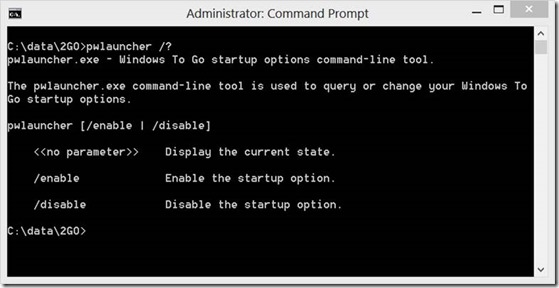
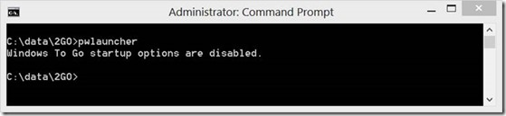
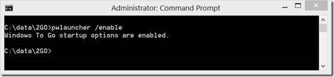
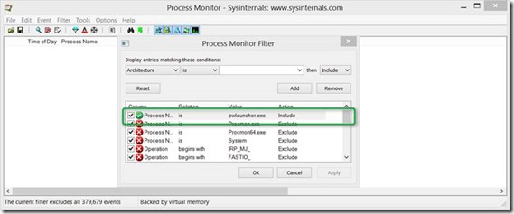
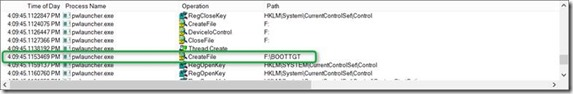
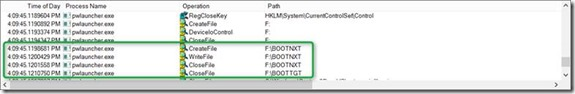
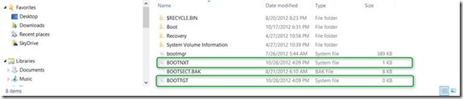

Windows To Go is another new feature introduced with Windows 8 but only available to users that run Windows 8 Enterprise. With Windows To Go users can create a Windows 8 workspace that can be booted from a USB drive. So simply said with Windows To Go, there’s no need to carry around a laptop if you’re going somewhere. If you have your Windows To Go workspace stored on a compatible USB drive, you can just boot your Windows 8 from any device that meets the Windows 7/8 hardware requirements. 

  The configuration steps required to boot from USB depends on what operating system is installed on the physical system. If the system is running an earlier version of the Windows operating system such as Windows 7, the boot order in the BIOS must be configured so that USB devices are set before the local disk. 

  On computers running Windows 8 there is no need for going into the BIOS because the configuration can be set using the Windows To Go Startup Options. 

  The startup options can be accessed by just entering the word “startup” on the Windows Start Menu

  

  Or for those who intend to create a desktop shortcut use   
 C:\Windows\system32\rundll32.exe pwlauncher.dll,ShowPortableWorkspaceLauncherConfigurationUX

  

  And of course there’s also a command-line version pwlauncher.exe

  With pwlauncher.exe we can check and configure the startup options. 

  

  On a default Windows 8 client, startup options are not configured. 

  

  To configure the startup option run pwlauncher.exe /enable

  

  I wanted to understand how and where Windows actually stores the configuration so configured [Sysinternal’s Process Monitor](http://technet.microsoft.com/en-us/sysinternals/bb896645.aspx) and configured it to watch pwlauncher.exe. 

  

  When executing pwlauncher /enable process monitor captures a lot of registry and file system actions. The registry actions however are just limited to query actions e.g. reading information, but no write actions. The file system actions however showed some file writing actions. 

  

  

  

  When enabling the startup options, Windows updates the file BOOTNXT and creates a new file BOOTTGT. 

  When disabling the startup options, Windows again updates the file BOOTNXT and deletes the file BOOTTGT

  Additional Information

  [Windows To Go step by step](http://social.technet.microsoft.com/wiki/contents/articles/6991.windows-to-go-step-by-step-en-us.aspx?PageIndex=3)    
[Get up and go! Windows To Go, that is….](http://blogs.technet.com/b/canitpro/archive/2012/10/26/get-up-and-go-windows-to-go-that-is.aspx)    
[Windows To Go Frequently Asked Questions](http://technet.microsoft.com/en-us/library/jj592680.aspx#wtg_faq_whatis)

