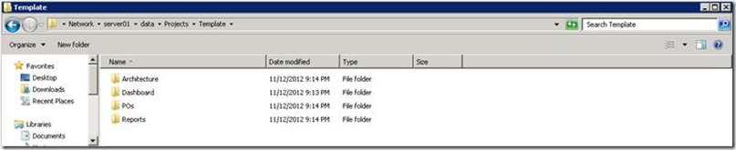
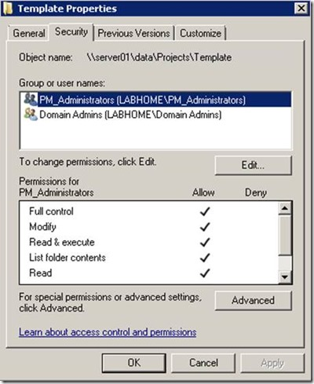
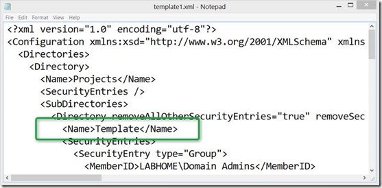
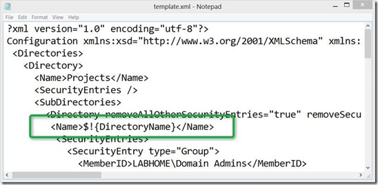
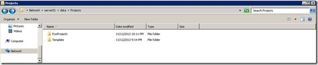
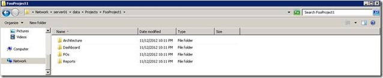
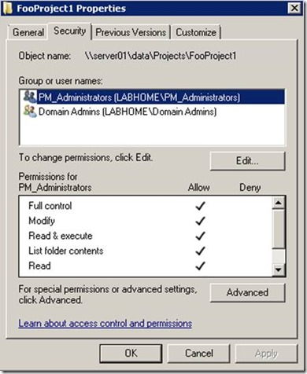

Are you an Administrator tired of manually creating folder structures for new projects? Then DirCreator is just what you need. DirCreator is an enterprise-proven tool to automatically generate structured, template-based directory structures, along with groups, members and ACLs.

  You can either create a template from scratch or create a template based on an existing folder structure. For this demonstration I first create a template folder structure on my home lab data share. 

  \\server01\data\Projects

  

  I also modify the folders permissions

  

  Next I run DirCreator with the following command line:

  C:\data\dircreator>DirCreator.exe ReadAcls -d \\server01\data\Projects -r true - x c:\data\template.xml

  This generates the template file template.xml

  As a next step, I’ll replace the folder name “Template” 

  

  With $!{DirectoryName}

  

  And then save the template.xml. To create a new Project folder called FooProject1 that contains all predefined sub folders, group members and ACL’s, I run the following command:

  C:\data\dircreator>DirCreator.exe -t c:\data\template.xml -n "**DirectoryName**=**FooProject1**"

  And see, a new Project folder is created, containing all predefined subfolders and folder permissions. 

  

  

  

  In this example I only used static AD group names, but if you have a little bit of time, you can customize DirCreator to automatically create project specific groups for you. 

  DirCreator can be used as a standalone command line tool or as a Windows Service where it will automatically process *.job.xml files once stored in the defined directory. 

  More information about DirCreator and download links can be found [here](http://dircreator.codeplex.com/)

