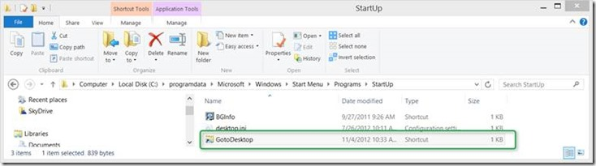

A few weeks ago I came across a blog [post from Brandon](http://netitude.bc3tech.net/2012/08/26/log-in-to-desktop-in-windows-8-yup-its-possible/) where he provides a solution how to automatically show the Windows Desktop when logging on to Windows 8. The solution is actually quite straight forward, all you need to do is to add a shortcut that points to explorer.exe to the Start Menu startup folder. When a user logs on, Windows processes the items stored within the Startup folder and executing explorer.exe then causes Windows to switch to the Desktop.

  By default the new Windows 8 Start Menu covers the Windows desktop, this sometimes can be an issue when running automated tasks where you want the user to see the progress, so they actually notice something is going on.

  So I took Brandon’s idea and wrote a script that automates the shortcut creation and when needed removes it again.

  set shell = WScript.CreateObject("WScript.Shell")

  Set objFSO = CreateObject("Scripting.FileSystemObject")

  StartupLocation = "C:\ProgramData\Microsoft\Windows\Start Menu\Programs\Startup"

  FileName = "GotoDesktop"

  windowsdir = shell.ExpandEnvironmentStrings("%windir%")

  'check for given arguments

  Set objArgs = WScript.Arguments

  Set objArgsNamed = WScript.Arguments.Named

  if WScript.Arguments.Count = 0 then

  NoCommand = 1

  myBuf = shell.Popup("Wrong start parameter!" & vbCrLf & vbCrLf & "GotoDesktop.vbs /add /remove", 60, "GotoDesktop", 48)

  WScript.Quit

  ElseIf WScript.Arguments.Count <= 1 then

  For Each strArg In objArgsNamed

  Select Case LCase(strArg)

  Case "add"

  mode = "add"

  Case "remove"

  mode = "remove"

  Case Else

  myBuf = shell.Popup("Wrong start parameter!" & vbCrLf & vbCrLf & "GotoDesktop.vbs /add /remove", 60, "GotoDesktop", 48)

  WScript.Quit

  End Select

  Next

  else

  myBuf = shell.Popup("Wrong start parameter!" & vbCrLf & vbCrLf & "GotoDesktop.vbs /add /remove", 60, "GotoDesktop", 48)

  WScript.Quit

  end If

  if mode = "add" Then

  Set shortcut = CreateObject("WScript.Shell").CreateShortcut(StartupLocation & + "\" + FileName + ".lnk")

  shortcut.Description = "GotoDesktop"

  shortcut.TargetPath = windowsdir & "\explorer.exe"

  shortcut.Save

  end if

  if mode = "remove" Then

  If objFSO.FileExists(StartupLocation & + "\" + FileName + ".lnk") Then

  objFSO.DeleteFile(StartupLocation & + "\" + FileName + ".lnk")

  Else

  Wscript.Echo "File does not exist."

  End if

  End if

  wscript.quit

  To add the shortcut, open an elevated prompt and run gotodesktop.vbs /add

  

  Note that I added the shortcut to the “AllUsers” folder, so the configuration applies to any user that logs on to the system.

  You will notice that when logging on to Windows 8, the desktop won’t show up immediately, this is because it takes a short moment until the items in the startup folder are being processed. Actually it will heavily depend on how much other content needs to be processed within the other startup locations.

  To remove the shortcut, simply run gotodesktop.vbs /remove from an elevated prompt, this deletes the shortcut from the startup folder.

  **Additional Information**

  [Log in to desktop in Windows 8? Yup, it's possible](http://netitude.bc3tech.net/2012/08/26/log-in-to-desktop-in-windows-8-yup-its-possible/)

